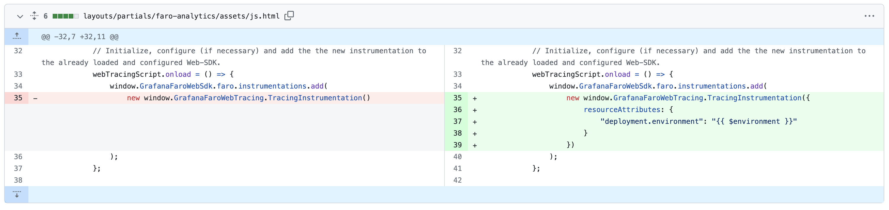
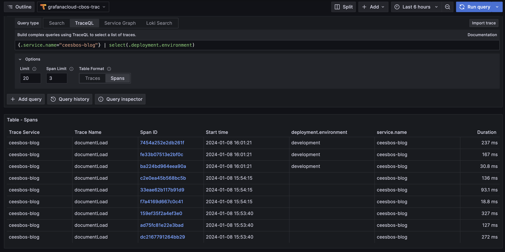
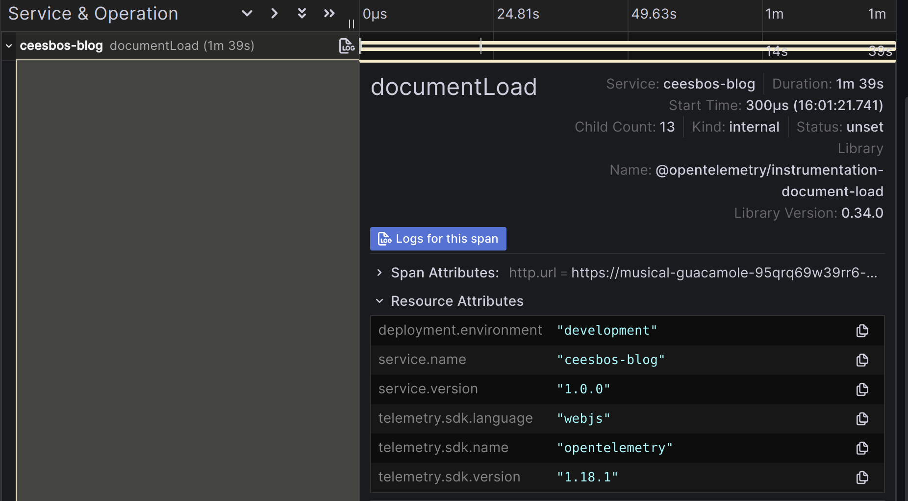

One of the great things about OpenTelemetry is the standardisation of span attributes and resource attributes.   
An example of this is `deployment.environment`.

| Attribute  | Type | Description  | Examples  | Requirement Level |
|---|---|---|---|---|
| `deployment.environment` | string | Name of the [deployment environment](https://wikipedia.org/wiki/Deployment_environment) (aka deployment tier). | `staging`; `production` | Recommended |

Source: https://opentelemetry.io/docs/specs/semconv/resource/deployment-environment/

With Grafana Faro you can configure the environment, as I explained in my [blog post](../20231124-blog-observability-with-grafana-faro) about the setup of Grafana Faro. This adds `environment` to the setup. 
In my [technical deep dive](../20231204-technical-deep-dive-into-grafana-faro) blog post I explained that the data is sent as logs and as traces.
The logs include the environment attribute which you can find that as `app_environment` attribute. 
But the information is **not available in the traces** stored in Tempo.

### Adding deployment.environment to traces

It is very easy to add `deployment.environment` to traces as well.

```js
webTracingScript.onload = () => {
    window.GrafanaFaroWebSdk.faro.instrumentations.add(
        new window.GrafanaFaroWebTracing.TracingInstrumentation({
            resourceAttributes: {
                "deployment.environment": "production"
            }
        })
    );
};
```
That is what I added to the Hugo Faro Analytics module:   
https://github.com/cbos/hugo-faro-analytics/commit/d4aeb1f973d4d38864d580bf32086ac1508d9506   



This is the result:





### Span metrics per environment

With this as a result, you can create dashboards where you can distinguish between the different environments.
And if you use [span metrics](https://github.com/open-telemetry/opentelemetry-collector-contrib/tree/main/connector/spanmetricsconnector), it is possible to split the metrics of the environments with the `dimensions` configuration.