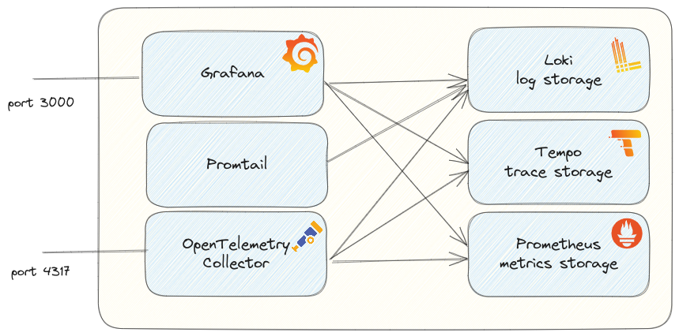
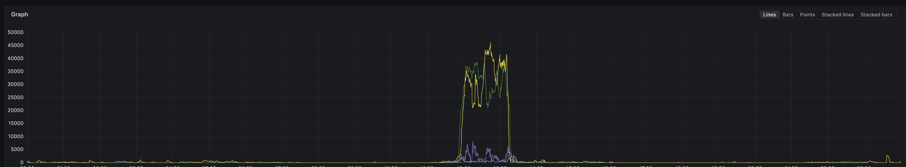
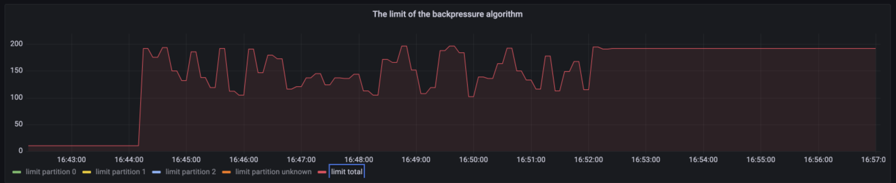

**Deep understanding of the actual behavior of a system** is key for me. I like to know all the details because it helps me to see the whole picture.
I am visually oriented, so tools like Grafana really help me in these situations.

Observability is a topic that has come up in the last few years, but I have actually been doing this for years. But the good thing
is that it is more standardized now. I really like that.

Two quotes from the book [Observability Engineering](https://www.oreilly.com/library/view/observability-engineering/9781492076438/) I want to share:

> Observability predominantly focuses on achieving a better understanding of the way software operates in the real world. 
> (Source: book Observability Engineering )

This first quote reflects exactly what I always try to do 😀.

> We'll cover the fundamentals of observability. We'll examine why structured events are the building blocks
> of observable systems and how to stitch those events together into traces. Events are generated by telemetry
> that is built into your software, and you will learn about open source initiatives, like OpenTelemetry, that help
> jumpstart the instrumentation process.   
> You will learn about the **data-based investigative process used to locate the source of issues in observable systems**,
> and how it differs substantially from the intuition-based investigative process used in traditional 
> monitoring. You will lean how observability and monitoring can coexist.
> (Source: book Observability Engineering )

The second quote highlights the process I like to do, the process of finding out where the real problems are. Not based
on guessing or assumptions, but based on (observability) data.

## Observability Toolkit

There are 2 parts to observability. One is the system(s). These systems must provide the actual data. This is not
done automatically. The systems must be instrumented to provide the data. 
This requires either manual instrumentation or automatic instrumentation (or a combination of both). 
The OpenTelemetry libraries are great for this, see [https://opentelemetry.io/docs/languages/](https://opentelemetry.io/docs/languages/)    
And if you want to know more about this, [this training](https://openvalue.training/observability_for_developers/) can help you with that

The second part is a stack where the data is collected and made available for analysis.    
I have been using several tools locally for years for all kinds of development and troubleshooting situations.

> Can you share the setup you locally use?

Last year I was involved in the investigation of major incidents where I used `Promtail`, `Loki` and `Grafana` to find the cause.   
Colleagues asked: Can you share the setup you use locally? Of course, and I shared an archive with a `docker-compose.yml` and some configuration files.   
That is what I want to share with [Observability Toolkit](https://github.com/cbos/observability-toolkit)

### Setup of Observability Toolkit
The setup of the Observability Toolkit is looks like this:
   
All the details are described at [https://github.com/cbos/observability-toolkit](https://github.com/cbos/observability-toolkit)

### Use cases
These tools are like a Swiss army knife to me. There are many situations where I have used them to learn about the application and its actual behavior.
Especially in cases where a combination of factors played a role.
To give just a few examples:

#### Finding problems in raw log files
While investigating a major outage, we thought we had found a component that played a key role in two outages in the same week. But we could not pinpoint exactly what was failing.   
We could see differences in resource usage on the monitoring dashboards, but nothing that would tell us what the real problem was.   
Then I asked if there was an access log file for this particular system and if that could give us a clue.   
I got 1Gb of raw files, manually inspecting the files was an endless job.

But luckily I had `promtail`, `loki` and `Grafana`.
I updated Promtail's configuration, placed the files in a directory that Promtail could use to load the files directly into Loki.
With Loki I did some parsing and this was the first result:

I would like to write a more detailed post about this in the future to show the configuration I used and the queries I used to get all the data out of Loki.

#### Verifying Actual Behavior
Another example is when I validated a reliability feature in the framework we use.   
This validation revealed the actual behavior:

The expectation was to have a flat line, but it showed a line with a lot of drops. In the end it appeared to be a bug in a library that had been fixed in the master, but not released.
This made it harder to find the actual problem, but a deep dive found the problem.

These are just a few examples where the toolkit can be used locally.

## Observability Toolkit as a Docker extension?

With Docker Desktop, it is possible to install [Docker extensions](https://www.docker.com/products/extensions/), which will help the life of users.   
With a single click, you can install a docker extension.    
My thoughts are that it may be helpful to make the Observability Toolkit available as a Docker extension.   
I have some ideas on what it should look like and how it can be created.   
Before I spend time creating an extension that will never be used, I would like to know if there is interest in such a Docker extension.    
**_Please leave a message below if you are interested._**
