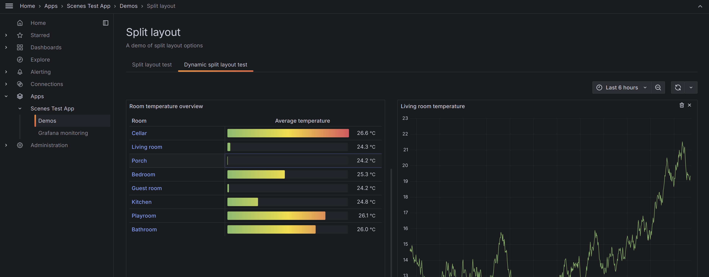
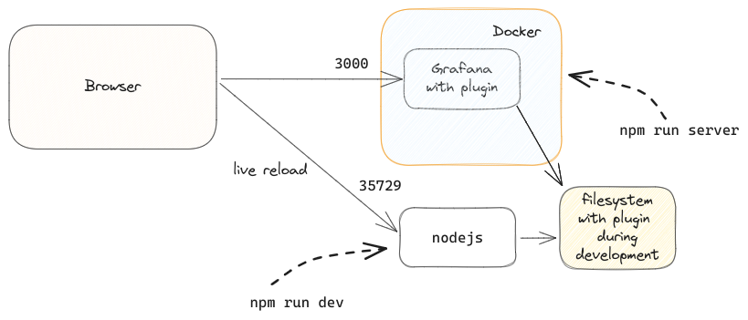
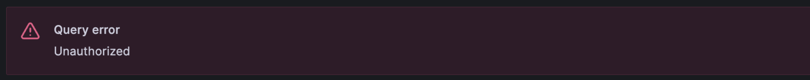
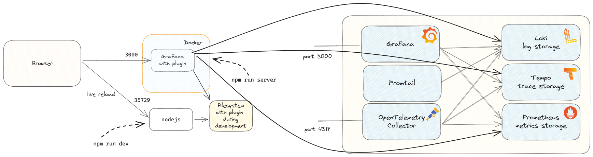
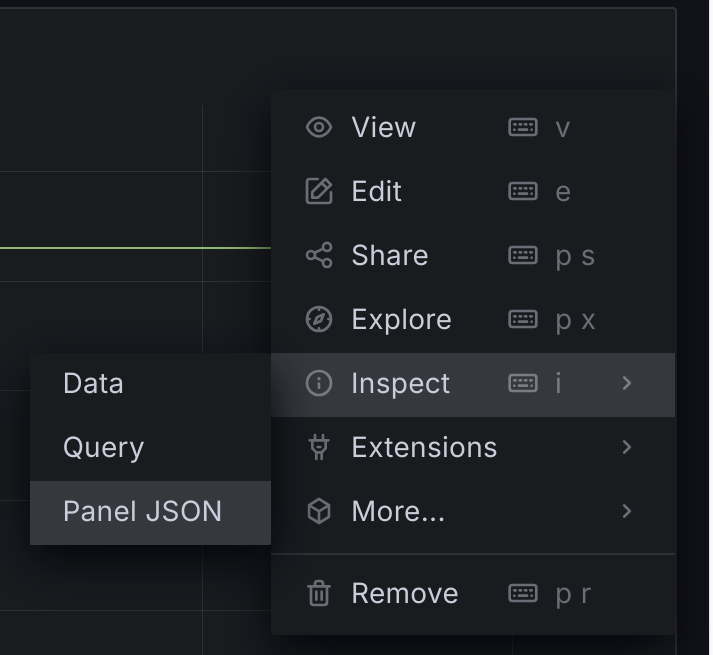

Grafana Scenes can enhance your experience with Grafana dashboards by bringing observability data together and guiding users to the right data.  
Combining metrics, traces and logs helps to understand the actual behavior of a system. That is the goal of observability. 
If a dashboard or an app created with scenes does not give the right insights, then still the `explore` feature of Grafana is available to dive into all data available searching for the unknown-unknown.

But how to get started with Grafana Scenes? In this blog post, I will share several tips based on my experience over the last few months. 

# Preparation
Before creating your own app, there are a number of things you can do upfront even before you actually start.

## 1) Start exploring the scenes demo app
Grafana Scenes code is available on GitHub: https://github.com/grafana/scenes    
In that repository there is a demo app available demonstrating a number of features.
To be able to run the demo app, you need `node`, `yarn` and `docker`, but that is also what you need for you app as soon as you start developing your own app.

Steps to start the demo app.

```shell
# Clone the Grafana Scenes repository
git clone git@github.com:grafana/scenes.git
# Go into the repository folder
cd scenes

# Install dependencies
yarn install

# Choose a Grafana version you like. The Grafana Scenes files use grafana/grafana-dev as image base. 
# Default is a 9.5 release, but you can use the latest 10.4 or already use a 11.0 dev build
export GRAFANA_VERSION=10.4.0-164329

# Start the convenient script to launch the demo app
./scripts/demo.sh
```

Now you can open [http://localhost:3001/a/grafana-scenes-app](http://localhost:3001/a/grafana-scenes-app)

This is screenshot for `tab pages` and the `split panel` features in an example page:


The demo app brings you a number of useful things:
- You can see the available features
- You can check the corresponding code how it is created
- You can modify the code and experiment with it
- And the live reload features instantly refreshes your browser. The code-test cycle is very short.

## 2) Follow the technical documentation
On the website [https://grafana.com/developers/scenes/core-concepts](https://grafana.com/developers/scenes/core-concepts) the concepts of Grafana Scenes are described.   
Together with the demo app, this will give you a good understanding of how Grafana Scenes works and what will be possible to create as app.   
The documentation includes several pages that describe the features of Grafana Scenes step by step, including the powerful features of tab pages and drill-down pages. These pages explain how to create them.

# Setup
After you have prepared, here are a number of tips for your setup. You can use them on your local machine or use remote development as a I described in [Grafana scenes with devcontainer and Codespaces](../20231215-grafana-scenes-with-devcontainer-and-codespaces)

## 3) Create your plugin 

As described by [Grafana scenes documentation](https://grafana.com/developers/scenes/#installation) it is easy to start with your own plugin:

```shell
# Create the plugin scaffold files
npx @grafana/create-plugin@latest

# Install the dependencies
npm install

# Build the plugin (by default this keeps watching for file changes and compiles it immediately 
npm run dev 

# Run the server (in a new terminal)
npm run server
```

Now you can go to [http://localhost:3000](http://localhost:3000) and go to the apps to see your new app.

The initial generated setup looks like this:


## 4) Port changes
Suppose you already have Grafana running on port `3000`, you can change the port very easy.   
Open the `docker-compose.yaml` and change the port number at the host side, for example in `3003`.   
With that change you can run multiple Grafana versions at the same time. 

```yaml
    ports:
      - 3003:3000/tcp 
```

If you have the demo-app still running, you will not face a port conflict on port `3000` as the demo runs on port 3001. But you will face a conflict on `35729` as that is the live reload port.
You can change that in 2 steps:

Open `.config/webpack/webpack.config.ts` and make a small change:
```ts
// Around line 190 you will find this line:
...(env.development ? [new LiveReloadPlugin()] : []),
    
    //this needs to be replaced with:
...(env.development ? [new LiveReloadPlugin({ port:35730})] : []),
```
Now the reload service will listen on port `35730`.
Now open `.config/Dockerfile` and make second change in the last line:
```Dockerfile
# Last line like like this, change 35729 into 35730
RUN sed -i 's/<\/body><\/html>/<script src=\"http:\/\/localhost:35730\/livereload.js\"><\/script><\/body><\/html>/g' /usr/share/grafana/public/views/index.html
```
Now restart both processes and open the browser again, if you changed the port of Grafana, the new setup is available on [http://localhost:3003](http://localhost:3003).    
When you open the developer tools of your browser, you can see the live reload communication as well on the specified port.

## 5) Cookie conflicts
When you are playing around with multiple Grafana instances on you machine you might face this error:


In the logging of Grafana I found this:

```text
logger=context t=2023-12-05T15:06:13.571376971Z level=warn msg="failed to look up session from cookie" error="user token not found"
logger=context t=2023-12-05T15:06:13.571420346Z level=warn msg="failed to look up session from cookie" error="user token not found"
logger=context userId=0 orgId=1 uname= t=2023-12-05T15:06:13.571983805Z level=warn msg=Unauthorized error="user token not found" remote_addr=192.168.65.1 traceID=
```
After some searching on the internet I found these references:
- [https://github.com/grafana/grafana/issues/61343](https://github.com/grafana/grafana/issues/61343)
- [https://community.grafana.com/t/error-logging-in-user-token-not-found/14996/5](https://community.grafana.com/t/error-logging-in-user-token-not-found/14996/5)

The problem is with the authentication cookie. The good news is that it is possible to change the configuration for that: [https://grafana.com/docs/grafana/latest/setup-grafana/configure-grafana/#login_cookie_name](https://grafana.com/docs/grafana/latest/setup-grafana/configure-grafana/#login_cookie_name)

In the `docker-compose.yaml` it is possible to add this setting:

```yaml
    environment:
      # Prevent cookie mixup problems with the Grafana instances, the value if the new cookie name
      GF_AUTH_LOGIN_COOKIE_NAME: grafana_session_scenes

```
Start the server and open Grafana again in your browser.

## 6) Link existing data sources
For developing a useful app you need data to display. Your local setup will not have that by default. Having the right data, makes the development iterations a lot easier.     
To solve that you can link existing data sources. You can use the data source provisioning.    
Suppose you locally have the [Observability Toolkit](https://goto.ceesbos.nl/observability-toolkit) and want to connect your scenes development, then your setup can look like this:



As you can see, this gives problems with both Grafana versions on port `3000`. You can change that as described above.
To link the data sources you can put the data source provisioning file in `provisioning/datasources` folder.

An example file:
```yaml
apiVersion: 1

datasources:
  - name: Prometheus
    uid: prometheus
    type: prometheus
    url: http://prometheus:9090
    editable: true
    isDefault: true
    jsonData:
      exemplarTraceIdDestinations:
        - name: traceID
          datasourceUid: tempo
```
In the documentation of Grafana there is more information about [provisioning](https://grafana.com/docs/grafana/latest/administration/provisioning/).    
Some more example can be found [here](https://github.com/cbos/observability-toolkit/tree/main/config/grafana/provisioning/datasources).    

:warning: You need to keep in mind that both are started with a separated docker-compose file and both have started with a different docker network.    
So either you can link the container to other network or you can expose the data sources to your host machine and `host.docker.internal` for Docker or `host.containers.internal` for Podman as hostnames.

# Building scenes

While building a scene you might wonder how create nice panels. Or you wonder what kind of interaction patterns are possible.

## 7) Inspect panel JSON
If you have already an example panel on a dashboard, you can leverage from that knowledge.    
Either inspect the JSON of the whole dashboard or use the 'inspect panel JSON' options.


In the JSON you can see the query details and configuration options for the query runner, you see the configuration options for the panel used.    
If you have overrides defined, you can see how the configuration is of these overrides. 
Based on this you can create the same overrides with Grafana Scenes.    
In you app development you will create the panels and query runners with Typescript. You can configure them in the same way as specified in JSON, but using Typescript.
Most settings have identical names, although some may be slightly different. Utilize code completion in your code editor to find the correct configuration option.

# Get inspired

Creating an app for your use case can be challenging. By seeing other apps, you might get inspired, at least that is how it works for me. New ideas arise based on other apps.

## 8) Use Application Observability and Frontend Observability as inspiration
If you are wondering how apps created with Grafana Scenes can look like, have a look at [Application Observability](https://grafana.com/products/cloud/application-observability/) 
and [Frontend Observability](https://grafana.com/products/cloud/frontend-observability-for-real-user-monitoring/). As far as I can tell without seeing the code, these are also built with Grafana Scenes.

# Let it grow 

## 9) Use the created app and improve further
When developing an app, it's important to remember not to try to build the perfect version in the first attempt. 
Instead, follow the best practices of software development and create a first version

Use the app yourself to identify any rough edges and make changes accordingly.    
Release a new version once you've made the necessary improvements.
Developing an app with Grafana Scenes is not different from any other development process :smile:.

## 10 Contribute
As Grafana Scenes is [open source](https://github.com/grafana/scenes), it is possible to contribute as well.
While developing, I noticed areas where Grafana Scenes could be enhanced and some functionality I wanted to use was not working as expected.
For sure, it is possible to create a ticket at the GitHub project. 
But it is also possible to contribute with a pull request. The advantage is that you can create the change locally, use it in your own app to see if it really works.

The changes I proposed are already merged and part of the release of Grafana Scenes. That is the power of open source, together making it stronger :muscle:.


