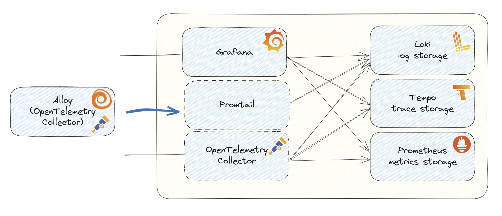
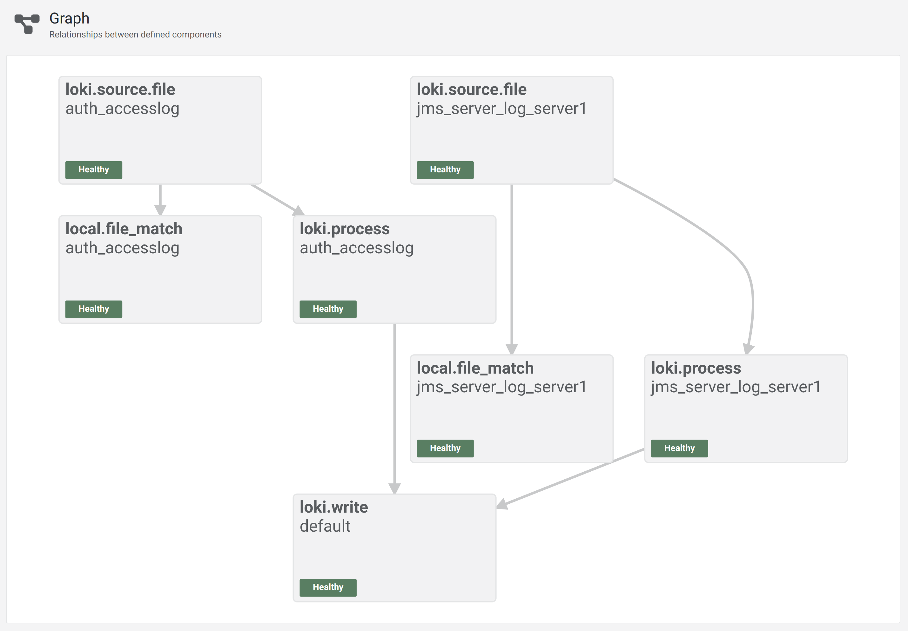
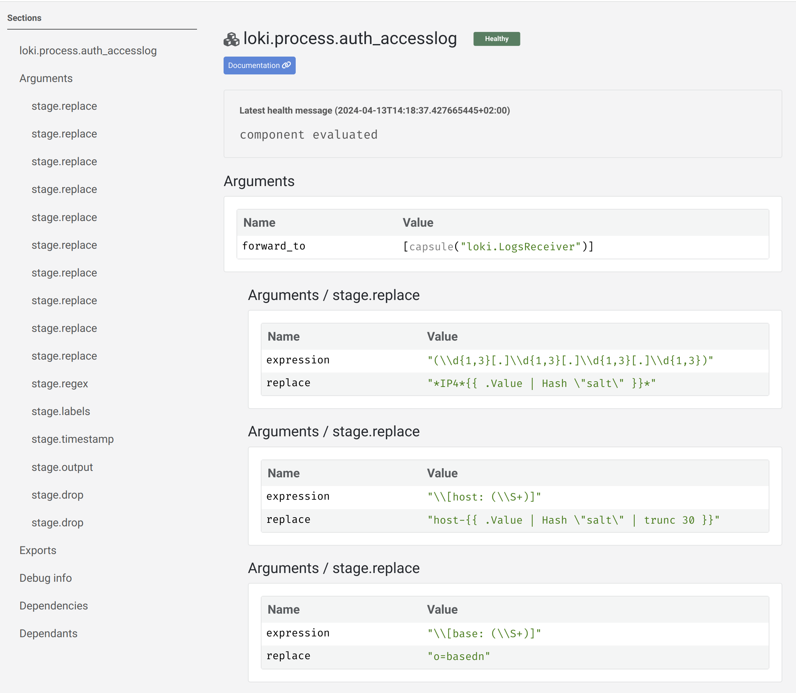

An announcement was made at GrafanaCON. [Alloy](https://grafana.com/blog/2024/04/09/grafana-alloy-opentelemetry-collector-with-prometheus-pipelines/) is introduced in the family of Grafana tools. 
Alloy is an open source distribution of the OpenTelemetry Collector, but is will also replace Promtail.

In the [Observability Toolkit](https://github.com/cbos/observability-toolkit) I use both Promtail and OpenTelemetry Collector, so it makes sense to merge them.   
In this blog post I will replace Promtail with Alloy. In another post I will see how replacing of OpenTelemetry Collector with Alloy will look like.



# Background

In preparation for my talk ['How visualizing logs converted to traces can uncover performance problems'](https://grafana.com/about/events/grafanacon/2024/transform-log-files-into-custom-traces-to-identify-performance-issues/)
I use Promtail to load the log files into Loki and to prevent revealing sensitive information I use Promtail's `replace` feature to replace and hash some data.    
After hashing, you can still see the difference between 2 user accounts for example, but you can't see the actual usernames.

This is a part of the Promtail configuration file:

```yaml

positions:
  filename: /var/log/positions.yaml # This location needs to be writeable by Promtail.

clients:
  - url: http://loki:3100/loki/api/v1/push

scrape_configs:

# /var/log folder is mounted
# So you can use __path__: /var/log in the scrape config to scrape files.
  - job_name: auth_accesslog
    decompression:
      enabled: false
      format: "z"

    static_configs:
      - labels:
          logType: accesslog
          __path__: /var/log/accesslog/*.log  # The path matching uses a third party library: https://github.com/bmatcuk/doublestar
    pipeline_stages:
      - replace:
          # IP4
          expression: '(\d{1,3}[.]\d{1,3}[.]\d{1,3}[.]\d{1,3})'
          replace: '*IP4*{{ .Value | Hash "salt" }}*'
      - replace:
          # hostname
          expression: '\[host: (\S+)]'
          replace: 'host-{{ .Value | Hash "salt" | trunc 30 }}'
```
Let's see how I can use Alloy as replacement of Promtail.

# Installation 

The installation of Alloy is easy. Multiple options are described in the [Alloy documentation](https://grafana.com/docs/alloy/latest/get-started/install/).   
As I want to use the migration option of Alloy I installed it as binary on my local Linux machine.

```shell
alloy --version

alloy, version v1.0.0 (branch: HEAD, revision: 1eef9b3ae)
  build user:       root@7197b65efb7f
  build date:       2024-04-05T20:54:07Z
  go version:       go1.22.1
  platform:         linux/amd64
  tags:             netgo,builtinassets,promtail_journal_enabled
```

# Convert configuration file

The installation went smoothly, now the configuration migration.   
Alloy comes with a migration option and it is well described.
In my case, I want to migrate from [Promtail to Alloy] (https://grafana.com/docs/alloy/latest/tasks/migrate/from-promtail/).

The shell command for that is very straight forward:
```shell
alloy convert --source-format=promtail --output=parse_files_config.alloy promtail-config.yaml
```
This command created an Alloy configuration file.   
This is what a snippet of that file looks like in my situation:

```text
local.file_match "auth_accesslog" {
	path_targets = [{
		__address__ = "localhost",
		__path__    = "/var/log/accesslog/*.log",
		logType     = "accesslog",
	}]
}

loki.process "auth_accesslog" {
	forward_to = [loki.write.default.receiver]

	stage.replace {
		expression = "(\\d{1,3}[.]\\d{1,3}[.]\\d{1,3}[.]\\d{1,3})"
		replace    = "*IP4*{{ .Value | Hash \"salt\" }}*"
	}

	stage.replace {
		expression = "\\[host: (\\S+)]"
		replace    = "host-{{ .Value | Hash \"salt\" | trunc 30 }}"
	}

...
}

loki.source.file "auth_accesslog" {
	targets    = local.file_match.auth_accesslog.targets
	forward_to = [loki.process.auth_accesslog.receiver]

	decompression {
		enabled = false
		format  = "z"
	}
	legacy_positions_file = "/var/log/positions.yaml"
}

loki.write "default" {
	endpoint {
		url = "http://loki:3100/loki/api/v1/push"
	}
	external_labels = {}
}
```
You can see the Alloy components with the configuration per component and how they are linked.   
The links create a flow between the components, which is how the actual content is routed.   
From `loki.source.file` named "auth_accesslog" to `loki.process` named "auth_accesslog" and finally to `loki.write` named "default".   
And you can see that the positions file is also migrated, which prevents files previously parsed by Promtail from being parsed again by Alloy.

# Testing the configuration

The new configuration file can easily be tested:
```shell
alloy run ./ 
```

Alloy also comes with a built-in user interface, which is available at: http://localhost:12345/graph    
In my case it looks like this:


You can click on the individual parts to see what is actually being used:


# Conclusion

The configuration migration went very smoothly. I did not replace the Docker container yet in the Observability Toolkit, I will do that in my next blog post when I also migrated the OpenTelemetry Collector configuration.