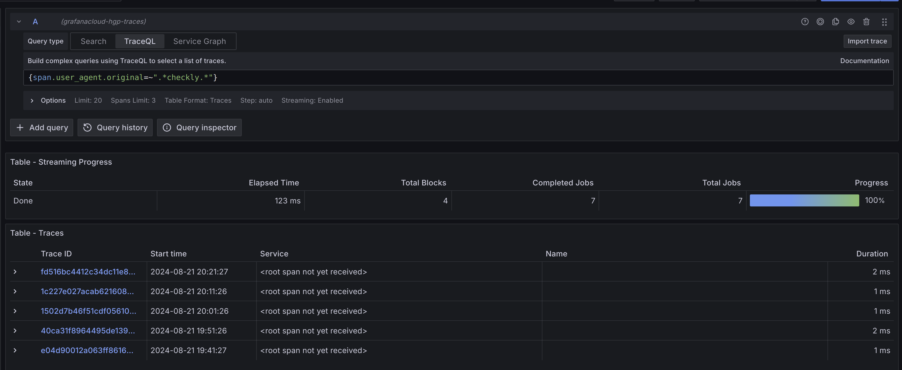
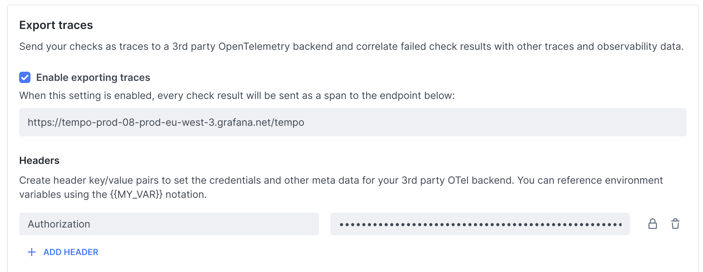
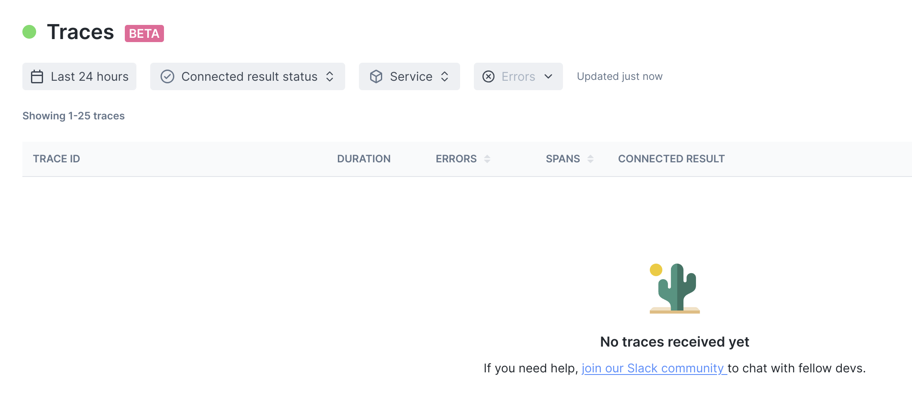
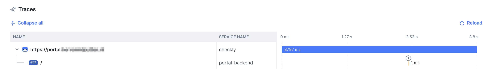

# Checkly
This week I came across [Checkly](https://www.checklyhq.com/), a code-first synthetic monitoring solution that can do API checks and browser checks using PlayWright.
It would have saved me a lot of time if this had been around 8 years ago. At that time I was working on a project where we were doing some external checks with a vendor like Checkly, but it was all manual configuration in a web interface.
And internally we had a checker tool running that did all sorts of internal checks, both HTTP checks and database checks.
The internal tool pushed all the metrics about the checks to InfluxDB for metrics and alerting with Grafana.

I also created a small internal web interface to see what route a particular request took and which services were hit by that request.
I did this by giving the request a special random marker that was logged by the services. By querying the logs from a centralised server, we could see the path of the request (this was before tracing was widely supported, unfortunately).

With Checkly, we could have used it for both external and internal checks. With the [private locations](https://www.checklyhq.com/docs/private-locations/) options, it is possible to start a docker container in your own infrastructure that can run the tests.
This allows you to have both the internal and external check results in one view.
With the Trace feature you can follow the requests to all services (if you have implemented tracing, which I highly recommend anyway, whether you use Checkly or not, traces are always valuable).

## Azure health checks
About two years ago, when I was working on another project, I used Azure [availability checks](https://learn.microsoft.com/en-us/azure/azure-monitor/app/availability?tabs=track).   
Azure uses Azure functions for these checks. I wrote some C# code to implement a multi-step check, doing a login and checking some pages.
Trace information was available in Azure monitoring.

The difference is that you have to create a separate project with the availability check(s), it is not part of your normal application codebase.    
It is not as convenient as Checkly's monitoring as code strategy. The availability checks require a separate deployment of the Azure function app.

# Monitoring as Code
Checkly uses an approach that I have not seen before, they call it `monitoring as code`.   
To me that is a bit of a misleading name. For me, monitoring is much more than just running periodic checks. Monitoring also includes checking for saturation of your services, just to name one aspect.
It is more `synthetic monitoring as code` if you ask me, but I really like the idea of doing the check with the deployment pipeline and pushing the check after deployment like you can do with [Github actions](https://www.checklyhq.com/docs/cicd/github-actions/).

# Traces feature
The Traces feature is currently in beta mode. As I am always curious about how these things work, I gave it a try.
I enabled a check on a web application that already had tracing enabled.

I can see the spans created by the Checkly requests. But this also gives the message: `root span not yet received`.    
This is because the root span is created by Checkly and the parent trace ID is sent in the request.   
Tempo is now missing this root span.

This can be fixed by adding a configuration on the Checkly site, but I have _not_ been able to get it to work yet.
There is no indication if it works or not, so the connection is successful or there are authentication problems.

## Forwarding traces to Checkly
I also followed the steps to send the traces from my OpenTelemetry Collector to Checkly with [these steps](https://www.checklyhq.com/docs/traces-open-telemetry/importing-traces/sending-traces-otel-collector/).
According to the Checkly configuration page the API key is being used.   
The traces view remains empty at the moment:

But when check a single trace I can see the span being sent by Checkly and I can see the span being produced by the web application

# Conclusion so far
I really like Checkly's approach and how it has been implemented. The Traces feature looks promising too.
In a future blog post I would like to explore the Prometheus integration to see what kind of data can be used in Grafana dashboards.   
I like having it all in one place, so you can see the failure of a check right in your application's dashboard, making correlation much easier.

**[ Update August 30th ]**      
The mentioned short comings are fixed, see [part 2](../20240830-checkly-and--opentelemetry-traces-part2) for more details