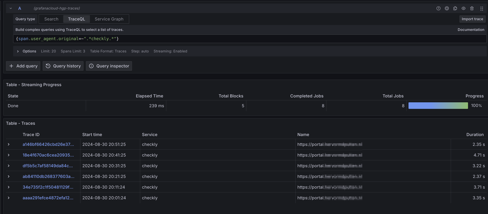
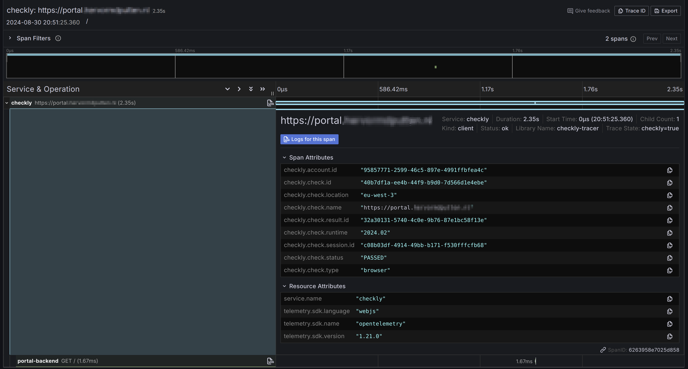
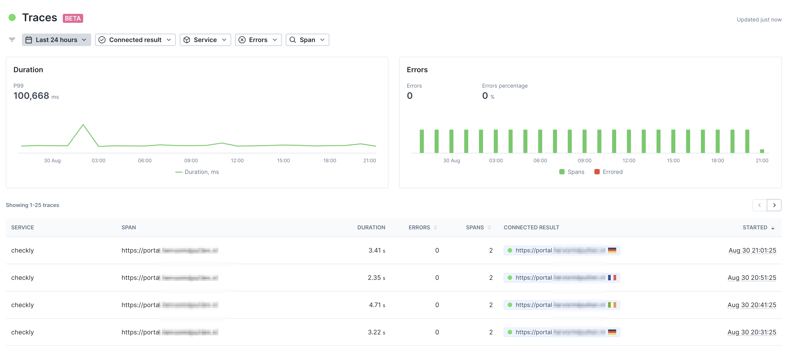

# Updates from Checkly

Based on my [previous post](../20240821-checkly-and--opentelemetry-traces) I have been in contact with Checkly about two parts that were not working as expected.
I have some updates on these topics today.

## Sending traces from Checkly to Tempo
In the previous post I mentioned that the traces in my Grafana environment showed `root span not yet received`.   
The root span was not available. This requires Checkly to send these spans to my environment as well.   
I used the original documentation, but that failed, which I wrote before.

Based on my experience with Grafana Cloud and OpenTelemetry I got it up and running a week ago, I provided this feedback to Checkly and based on that the documentation is updated :thumbsup:   
The [Checkly documentation](https://www.checklyhq.com/docs/traces-open-telemetry/exporting-traces/grafana-tempo/) shows the steps to set up the OpenTelemetry endpoint at Grafana Cloud and how to use it from Checkly.

With this integration the traces look like this:

A single trace in more detail:

## Trace overview in Checkly
The trace overview was empty last week, but it is now fixed and shows all traces.

Each trace can be opened and shows all the details of the spans.

# More to come
In the meantime I also experimented a bit with the Prometheus integration to get the metrics in Grafana.   
Next time I plan to write about this topic.

