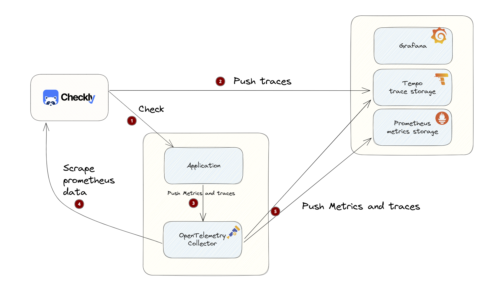
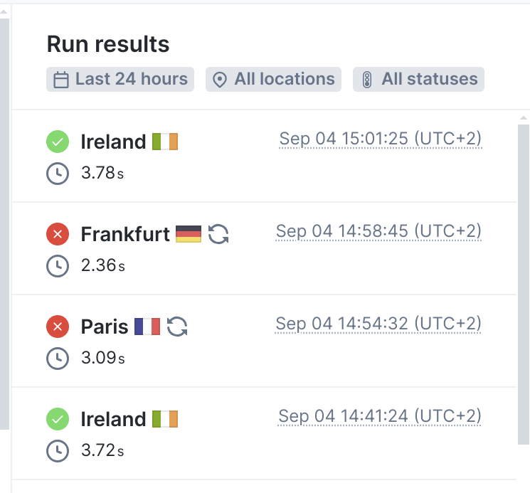
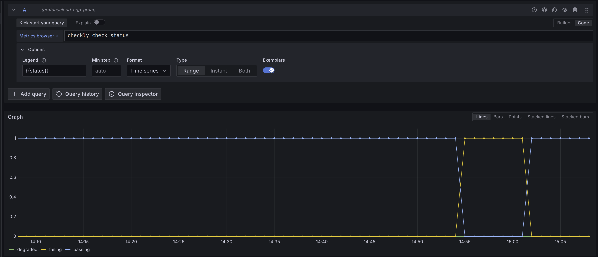
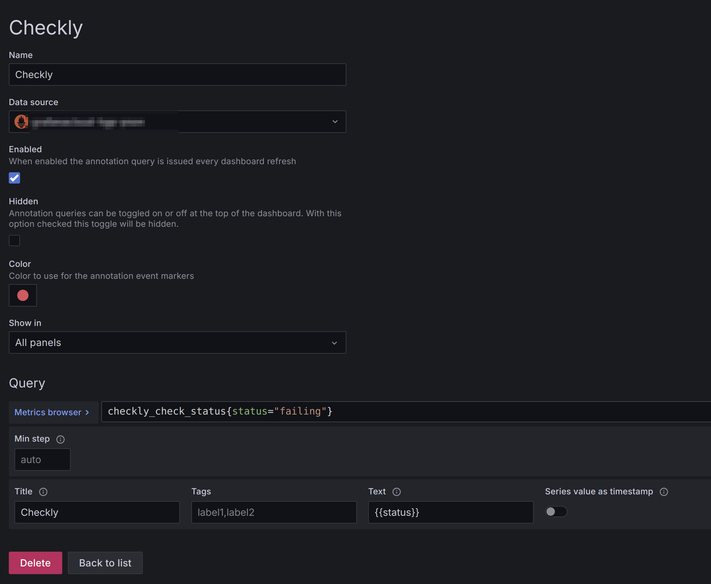
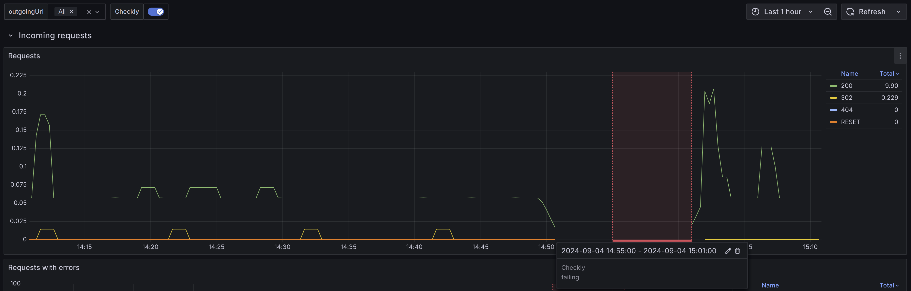

# The power of observability
The power of observability becomes visible when you combine signals and put it all together.    
Checks performed by Checkly can provide a piece of the puzzle that gives you a better view of what is happening.
For example, suppose you have a load balancer failure that prevents traffic from reaching your application.
A check with Checkly will `fail` and you will see a dip in your application metrics.

Or you have a performance problem, because of which Checkly fails and reports a `degraded` state.   
It would be really nice if you could combine the data from Checkly in the same dashboards as your other observability data.

There are 2 ways to do this. The first is to have the traces in your own stack, which I have described in 2 other posts.
See [part 1](../20240821-checkly-and--opentelemetry-traces) and [part 2](../20240830-checkly-and--opentelemetry-traces-part2).   
The second part is the Prometheus integration. Checkly exposes a lot of metrics about the checks as Prometheus data via an endpoint that can be scraped.
Details are available in the [prometheus integration documentation](https://www.checklyhq.com/docs/integrations/prometheus-v2/).

### Setup
The setup I use looks like this:



1. Checkly checks my test application every 10 minutes.
2. Trace information is sent to Grafana Cloud.
3. My application pushes its own spans and metrics to OpenTelemetry Collector.
4. I have also added a Prometheus scrape configuration to my OpenTelemetry Collector configuration.
5. All metrics and traces are pushed to Grafana Cloud metrics.

```yaml
  prometheus/checkly:
    config:
      scrape_configs:
        - job_name: 'checkly'
          scrape_interval: 60s
          metrics_path: '/accounts/xxx/v2/prometheus/metrics'
          bearer_token: 'xxx'
          scheme: https
          static_configs:
            - targets: [ 'api.checklyhq.com' ]
```

It is possible to create a complete Grafana dashboard based on the available metrics. This is not what I did for this test.
There is a public dashboard available at [Grafana Dashboards] (https://grafana.com/grafana/dashboards/14277-checkly-dashboard/), but it is based on the Prometheus v1 integration, which is deprecated by Checkly.
The dashboard needs some rework to support Checkly's Prometheus v2 metrics. If you need help with this, please leave a comment, I can help.

### What does a failure look like in metrics?
To test a failure, I brought down my application and this is what you can see in the checks:

The checks are executed every 10 minutes at xx:x1:24, but the failed test takes longer to finish.
The failure is registered at 14:54:32, 3 minutes later.   
Prometheus metrics scraping is done once per minute, so it can take a while for it to show up in the metrics, and this is what you see:

After the successful check, you can see that it takes a bit to scrape the successful result and change the line again.

### Correlation by annotating a dashboard
Adding [annotations](https://grafana.com/docs/grafana/latest/dashboards/build-dashboards/annotate-visualizations/) to a Grafana dashboard is a very powerful mechanism for highlighting when outages or other events have occurred.
You can also annotate when deployments are completed, for example. You can add the annotations manually, but you can also use metrics to do this.

This is how I configured the annotations in my dashboard.
NOTE: I only have one check active in Checkly. If there were more checks, every failed check would appear as an annotation in my dashboard.
A more selective Prometheus query can be used to select only 1 or a small set of checks, depending on your situation.


The result of the annotation looks like this:



In this particular situation, you can also see from the other metrics when the problem occurred, but in some other cases it might not be so clear.   
Annotations can help to highlight this period so that you can easily check other metrics in this period if they also show some deviations from the normal situation.
For example, if Checkly reports `degraded`, you can probably also see other high response times in the same period. This can help you find the cause of the problem.

Combining all signals in one place gives you more insight.