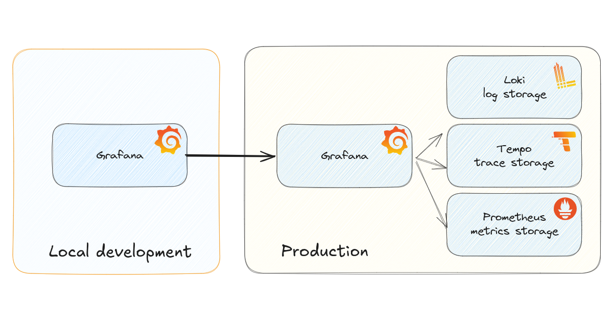

Service accounts

https://grafana.com/docs/grafana/latest/administration/service-accounts/


Locally create a new datasource.


https://cbos.grafana.net/api/datasources/proxy/uid/grafanacloud-prom/


## Cookie based
If service keys is not possible for a reason, you can use a cookie as well.


## Provision as datasources

```yaml
apiVersion: 1

datasources:
  # Example datasource with a Service key
  - name: production-proxy-service-key
    type: prometheus
    access: proxy
    url: https://cbos.grafana.net/api/datasources/proxy/uid/grafanacloud-prom/
    jsonData:
      httpMethod: POST
      # Name of the header
      httpHeaderName1: Authorization
    secureJsonFields: { }
    secureJsonData:
      # Value of the header
      httpHeaderValue1: Bearer <paste here the service key token>

  # Example datasource with a cookie
  - name: production-proxy-with-cookie
    type: prometheus
    access: proxy
    url: https://cbos.grafana.net/api/datasources/proxy/uid/grafanacloud-prom/
    jsonData:
      httpMethod: POST
      # Name of the header
      httpHeaderName1: Cookie
    secureJsonFields: { }
    secureJsonData:
      # Value of the header
      httpHeaderValue1: <paste here the cookie value from the browser>
```