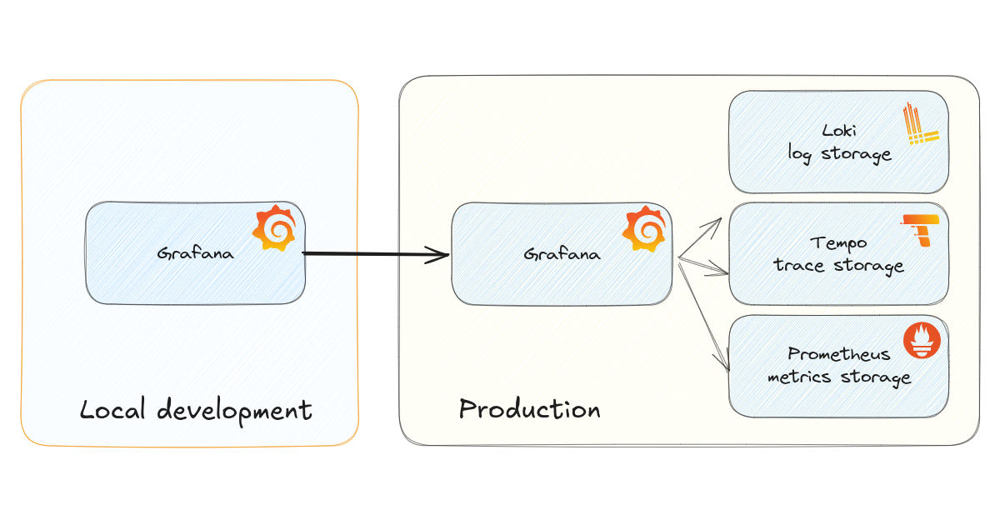
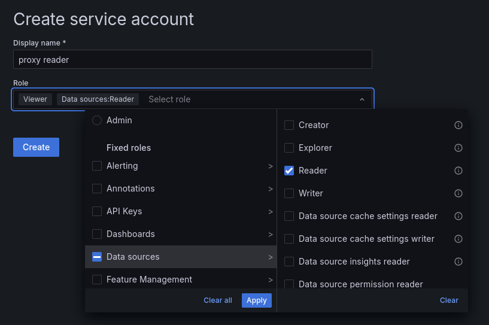
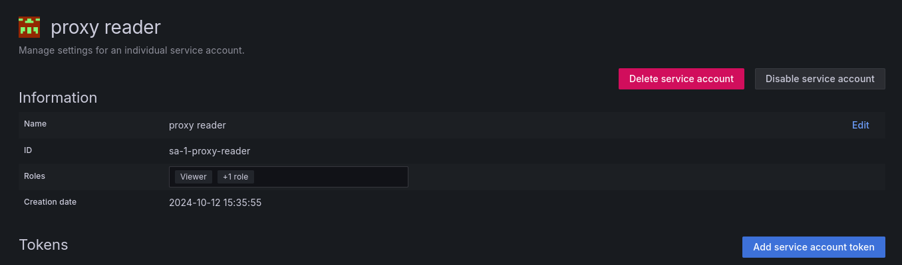
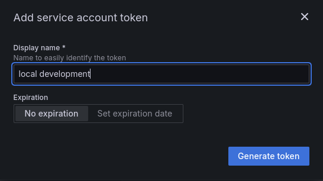
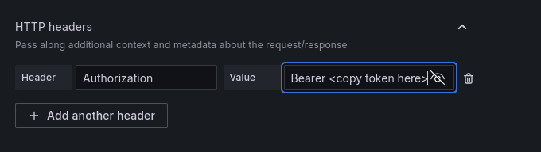
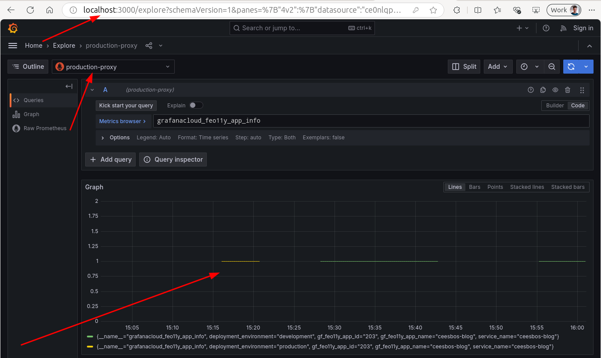
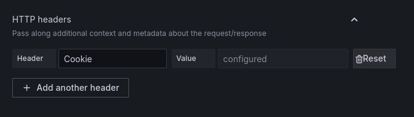

If you are developing content for a Grafana instance, you may have experienced this. I have faced this problem a few times.   
When I develop a Grafana plugin on my local development machine, I like to have representative telemetry data.   
In previous posts I mentioned developing plugins with [Grafana Scenes](../../tags/scenes). This post can help you with Grafana Scenes plugins with local development.

I have also used [OpenTelemetry demo](https://github.com/open-telemetry/opentelemetry-demo) in some cases, but this does not always produce the right data what I needed.
Especially when production has a large set of services, it is hard to simulate this locally.

### Connecting directly to production data sources

In some cases it is possible to connect directly to your data sources such as Prometheus. This is possible with Grafana Cloud, for example. Access to the data sources can be managed via the [Grafana Cloud Portal](https://grafana.com/docs/grafana-cloud/account-management/cloud-portal/).    
But this also requires that you get the credentials or a service account to connect to that data source. This is not always possible.

So what are the other options?

### Grafana as proxy

But what if you could use the production Grafana as a proxy to read the data? As a Grafana user, you are already allowed to see the metrics, for example.
It is possible to have your local Grafana connect to the production Grafana and read the data through Grafana.

The setup looks like this:


#### Connect with a service account

In Grafana you can create a [service account] (https://grafana.com/docs/grafana/latest/administration/service-accounts/).
Such an account is not tied to a user and has it's own life cycle. A service account can also be revoked.

##### Step 1: Create a service account
You start by creating a `service account' and giving it read permissions on a datasource:


Once the service account is created, create a `service account token':


And give the token a logical name so you know where this token will be used:


Keep the token safe. This is your key to enter Grafana and read the data.

##### Step 2: Create a datasource
Now it is time to create a datasource in your local Grafana.   
To access the datasource, you need to specify a URL.
The URL looks like this `https://<grafana host>/api/datasources/proxy/uid/<ID of the datasource>/'.

The datasource ID is not always the same as the datasource display name. If you open the datasource list in Grafana, you can see the ID in the URLs.
So you need to do a bit of digging to find the ID.

In my example it is: https://cbos.grafana.net/api/datasources/proxy/uid/grafanacloud-prom/
NOTE: As mentioned above, Grafana Cloud datasources can be accessed directly, so there is no need to use Grafana as a proxy for Grafana Cloud. But this is an example in this case.

To authenticate, you need to add a header, in this case an `Authorization` header. The value of the header MUST contain `bearer ...`, where you have to copy the token created above as value on the dots.



##### Step 3: Check your results



#### Connecting with a cookie
If for some reason the service keys are not possible, you can also use a cookie.    
If you open the production Grafana and then open your browser's developer tools, you can check the request headers and see a 'cookie' header being sent.
You can copy this cookie value and use it as header value for a `Cookie` header in the datasource configuration:



NOTE: Cookies often expire relatively quickly. So a cookie is not very persistent, you may need to repeat this once a day or even more often. This is a drawback, so service accounts are preferred.

### Deploying as datasources

Instead of creating the datasource locally by hand, it is also possible to provide it via a yaml file.
In a Grafana Scenes development setup, it is a common situation to have a yaml configuration with your datasources.

You can use a datasource yaml like this:

```yaml
apiVersion: 1

datasources:
  # Example datasource with a Service key
  - name: production-proxy-service-key
    type: prometheus
    access: proxy
    url: https://<host>/api/datasources/proxy/uid/<id of the datasource>/
    jsonData:
      httpMethod: POST
      # Name of the header
      httpHeaderName1: Authorization
    secureJsonFields: { }
    secureJsonData:
      # Value of the header
      httpHeaderValue1: Bearer <paste here the service key token>

  # Example datasource with a cookie
  - name: production-proxy-with-cookie
    type: prometheus
    access: proxy
    url: https://<host>/api/datasources/proxy/uid/<id of the datasource>/
    jsonData:
      httpMethod: POST
      # Name of the header
      httpHeaderName1: Cookie
    secureJsonFields: { }
    secureJsonData:
      # Value of the header
      httpHeaderValue1: <paste here the cookie value from the browser>
```