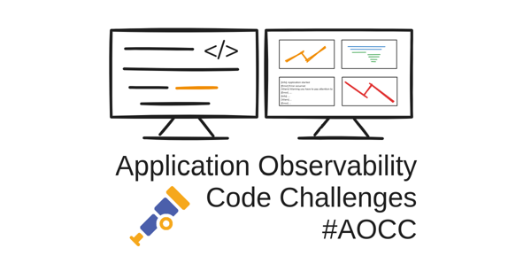
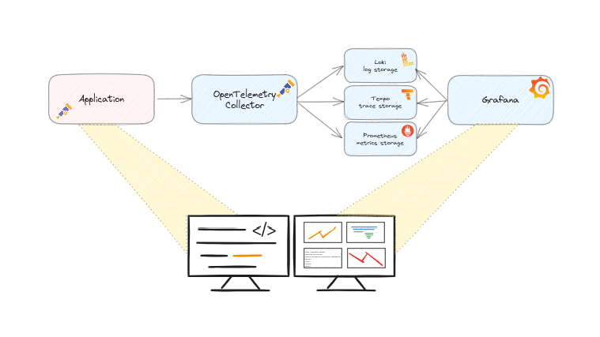
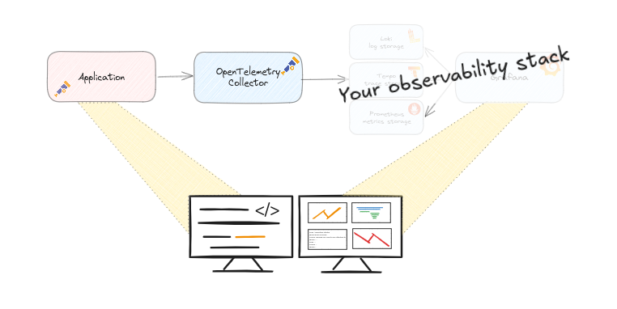

Code challenges are nice way of fun programming, which has a resulted some nice challenges like the [1brc](https://1brc.dev) and the yearly [Advent of Code (AoC)](https://adventofcode.com). 
In these mentioned challenges there is also a competition element, but that is not the case for the Application Observability Code Challenges.

## What are Application Observability Code Challenges?
The idea of these challenges came into my mind based on the above challenges and the fact that I see in practice that quite some developers are struggling with getting up to speed with applying observability practices.

The challenges are small applications or code samples. When you write your code, you make the application with a goal in mind and you test the behavior of your application.
But do you know your application is doing what it is supposed to do? Observability is about: 

> How effectively you can understand system behaviour from the outside using the data it generates.

The sample application has certain behaviour and can you understand that behaviour from outside the system? 
If you put your application in production and you get paged in the middle of the night because of some problems, how do you know for sure that the system is behaving as expected?

That requires two things: your application is observable in the first place and you should have the skills to use your observability tools in the second place.
But also during development, when you run your (performance) tests, you need to understand the behaviour of your application to make the right decisions if your code changes are production ready.
Observability data can help you in making that decision.

# Goals
The goals of the challenges:
- Have fun!
- Learn to understand the behaviour of the code
- Learn how to use observability tools to understand the behaviour of the code
- Spot the unexpected behaviour, what would otherwise be a challenge 😀?
- Practice and learn!
- Share your finding and your solution, either as comment or as pull request.

The goal is not to discuss about the used libraries, frameworks, or the specific code implementation, but to practice and learn!

## Prepared environment

Local or via a prepare and guided environment (available for 60 minutes) at https://killercoda.com/ceesbos

## You own stack

