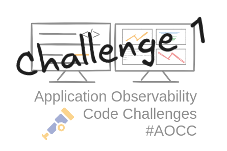
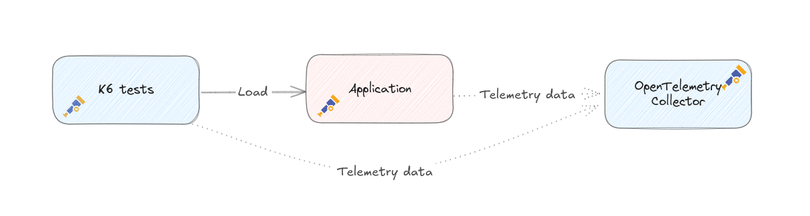
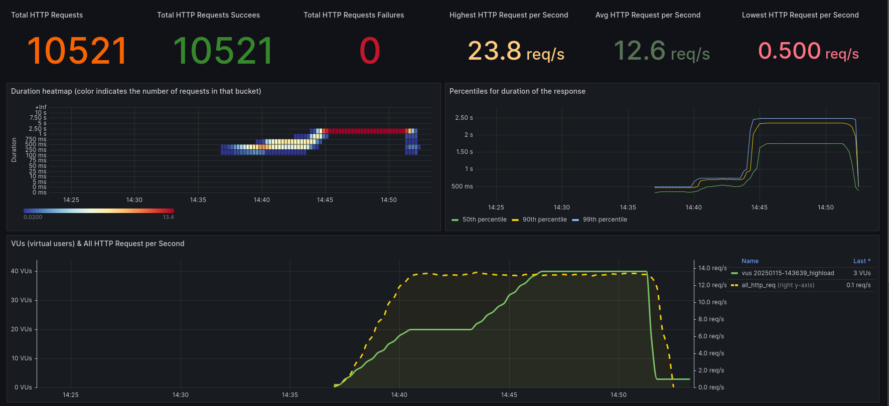

The first challenge of the Application Observability Code Challenges is now available.   
See the [announcement blog](../application-observability-code-challenges) for more information about the challenges in general.
The goal is to have fun and learn in the first place.

> 🚨 **Challenge**:
> - Run the sample application
> - Run the tests to see what happens
> - Try to find out what happens, make a hypothesis❗
> - **Improve the observability** of the application to **prove the hypothesis**
> - Optional: fix the problem and **prove it with observability data that it is really fixed**
> - Optional, but highly appreciated 🙏: Share your findings, insights you learned and potential solution, either as a ['discussion'](https://github.com/cbos/application-observability-code-challenges/discussions) or as a pull request

### Run local or with an online environment
All details of the challenge are available at [https://github.com/cbos/application-observability-code-challenges/tree/main/challenge-01](https://goto.ceesbos.nl/ghch01)
An online guided environment is available with KillerCode, see [https://killercoda.com/observability-code-challenges](https://goto.ceesbos.nl/aocckk)

### Challenge details

- The sample application is a simple Spring Boot application with a REST endpoint implemented in Jersey/JAX-RS.
- The application is instrumented using OpenTelemetry auto instrumentation.
- You can either run the application with Docker or directly.
- K6 load scripts are prepared to run tests that provide more insight into the issues.

The setup looks like this:

After running one of the scripts you can get more details in a Grafana dashboard like this:

In this screenshot you can see that the application is reaching a limit for some reason, more load does not give more requests per second and with more load the response times increase a lot.

Go to the challenge: [https://github.com/cbos/application-observability-code-challenges/tree/main/challenge-01](https://goto.ceesbos.nl/ghch01)

### Feedback?

If you have any feedback, please let me know. You can leave a comment below, send me a message on Bluesky, Mastodon, LinkedIn or in the ['discussion'](https://github.com/cbos/application-observability-code-challenges/discussions) section of the challenge's Github repository .

