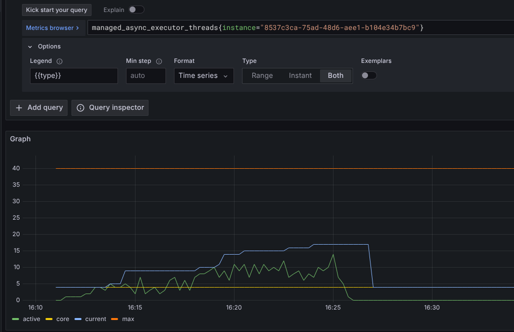

> [!CAUTION] **Spoiler alert** 
> This page contains a step by step explanation of [challenge 1](../aocc-challenge-01). 

At the start of the [Application Observability Code Challenges](../application-observability-code-challenges) I described observability as:
> How effectively you can understand the behaviour of the system from the outside, using the data it generates.

In this blog post I will go through the results step by step and explain what you can see in the metrics and traces to see what is actually going on in the application.
To start, I ran the three K6 scripts one after the other, which resulted in this:


You can see that the first script ran and everything seems to be fine, the second script produces much more load and has 40 concurrent users at the top.
The third script has a small number of users, runs fine for a short time and then has very high response times.
But this is only what we see from the outside with the K6 test results.

# Service metrics
As mentioned in the challenge, there is also a dashboard for the service metrics.
This is a screenshot of a part of the dashboard showing the request rate, duration and number of active threads:

In the blocks I marked when the 3 scripts were executed.

> [!QUESTION]
> What can we learn from these metrics?

## Request rate panel (on top)
This shows the same pattern as the K6 detail view. More users means more requests, but nothing which directly takes attention.

## Duration panel ( in the middle )
The duration histogram follows the same pattern as the K6 detail view, **but** there is a small difference: By the third run, it stops showing response times.
It even stopped sending responses for 5 minutes ... for the heavy requests it takes 5 minutes, but why are other responses not returned?
I did not take the full screenshot, but after this it even goes way up, which are 5 minute responses, polluting the graph.

## JVM Threads
The thread panel shows a very consistent number of threads. Even with 40 concurrent users during the second test run, the number of threads does not increase much.
This indicates that at least one thread is not being created per user.

## Tomcat threads
This is also supported by the panel with Tomcat threads.
In a model where each (concurrent) request is handled on a thread, you would expect the number of Tomcat threads to increase. This is not the case here.
And this is also expected, as our application uses `async' message handling. In this case, the requests are offloaded to an async handler. This may create new threads if necessary.


## JVM memory usage
Can we see any special behaviour regarding memory usage? Not really, it behaves normally. The garbage collector kicks in from time to time and is able to free the memory as expected.


> [!QUESTION]
> What about traces?

A trace has also been created for each request. What can we learn from those traces?
Using [TracQL](https://grafana.com/docs/tempo/latest/traceql/) we can query for the traces in the time period of the execution.
This is a query to look for all traces where the `challenge-01` service was involved:
```
{.service.name="challenge-01" && duration>1s}
```

This is an example trace:


Unfortunately we cannot see anything based on this, we can see that it took 2 seconds to process this request, no further details...

> [!QUESTION]
> What can we do to improve the observability to get more insight?

What kind of additional information can we extract from the application to get more information about what is going on?

## What can we do to see if our own code is behaving as expected?

This is the main part of the code that handles the request. What can be improved here?
```java
@GET
@Path("/{id}")
@Produces(MediaType.APPLICATION_JSON)
@ManagedAsync
public Response getChallengeById(@PathParam("id") Integer id) throws InterruptedException {
    logger.info("getChallengeById");

    List<Challenge> challenges = handleRequest(id);
    if (challenges.isEmpty()) {
        return Response.status(Response.Status.NOT_FOUND).build();
    } else {
        return Response.ok(challenges).build();
    }
}
```
We could **add some log statements** and try to correlate which log lines are related to the same request. This is actually **already done by OpenTelemetry**!
OpenTelemetry adds the traceId to the log. With more log lines, we can see which lines were added at which times. Then we can see where the time is spent, or which error message is generated as part of which trace.
We won't explore this for now, maybe in another challenge.

We can also use 'internal spans'.

## OpenTelemetry span annotation
OpenTelemetry has a way of adding spans to your code without adding a lot of code. This is described here:
https://opentelemetry.io/docs/zero-code/java/agent/annotations/

In our POM we can just add a simple dependency:
```xml
<dependency>
    <groupId>io.opentelemetry.instrumentation</groupId>
    <artifactId>opentelemetry-instrumentation-annotations</artifactId>
    <version>2.15.0</version>
</dependency>
```
And we can change our code just a little.    
@WithSpan("Name of the span") is already enough, but we can add some more information by annotating the parameters as well:
```java
@WithSpan("Handle request")
private List<Challenge> handleRequest(@SpanAttribute("id") int id) throws InterruptedException {
    // Request handling as part of the internal span
}
```

## Rebuild, restart and run test again

```shell
just build # Build the project again
just down  # Stop the current container
just up    # Start the new again with the new build

just k6-high-load # Run the high load scenario again
```
## Check new traces
If we look for traces again during the first part of the we can find a trace like this.
Here you can see the server span with a child span, which is the actual request handling logic.


Later in the run, when the request duration was high again:

Ok, strange. The request is captured, but the execution is delayed. The actual execution was fast, but the delay was **before** the processing.

What can we see if we open the details of the spans:

We can see the `id` attribute, which we filled with the @SpanAttribute annotation.
And there is a `thead.name` attribute. The first span is handled by a different thread than the second span.
And the second thread is a thread from the async executor. Is it possible that the async executor is not behaving as expected?

## Async executor

There is some configuration in the code for the async executor. It has a core size of 4 threads and a maximum of 40.
This should be sufficient for 40 concurrent users as with the second script.

```java
@ManagedAsyncExecutor
public class ManagedAsyncExecutorProvider extends ThreadPoolExecutorProvider {
    public ManagedAsyncExecutorProvider() {
        super("challenge01-managed-async-executor");
    }

    @Override
    protected int getCorePoolSize() {
        return 4;
    }

    @Override
    protected int getMaximumPoolSize() {
        return 40;
    }
}
```
**But wait... we did not see the number of threads increase during the runs. How does the executor handle the tasks? Does it scale properly?

> [!QUESTION]
> What can we do to improve the observability of the async executor?

## Extending instrumentation with the OpenTelemetry API

OpenTelemetry has an API library that can be used to improve the observability.        
For more details see: https://opentelemetry.io/docs/zero-code/java/agent/api/

We can add another a dependency to our project:
```xml
  <dependency>
    <groupId>io.opentelemetry</groupId>
    <artifactId>opentelemetry-api</artifactId>
    <version>1.49.0</version>
  </dependency>
```

Now we can extend the code of the ManagedAsyncExecutorProvider:
````java

@ManagedAsyncExecutor
public class ManagedAsyncExecutorProvider extends ThreadPoolExecutorProvider {

    private final AttributeKey<String> TYPE = AttributeKey.stringKey("type");
    private final String CORE = "core";
    private final String ACTIVE = "active";
    private final String MAX = "max";
    private final String CURRENT = "current";

    private final String CREATED = "total_created";
    private final String COMPLETED = "completed";

    public ManagedAsyncExecutorProvider() {
        super("challenge01-managed-async-executor");
    }

    @PostConstruct
    public void init() {
        //Get the executor, it created only once as singleton, so we can use this to add metrics
        final ThreadPoolExecutor executor = getExecutor();

        Meter meter = GlobalOpenTelemetry.getMeter("Challenge01Application");
        // Add measurements for the threads
        meter.gaugeBuilder("managed_async_executor_threads")
                .ofLongs()
                .buildWithCallback(
                        measurement -> {
                            measurement.record(executor.getCorePoolSize(), Attributes.of(TYPE, CORE));
                            measurement.record(executor.getMaximumPoolSize(), Attributes.of(TYPE, MAX));
                            measurement.record(executor.getPoolSize(), Attributes.of(TYPE, CURRENT));
                            measurement.record(executor.getActiveCount(), Attributes.of(TYPE, ACTIVE));
                        });

        // Add measurements for the tasks
        meter.gaugeBuilder("managed_async_executor_tasks")
                .ofLongs()
                .buildWithCallback(
                        measurement -> {
                            measurement.record(executor.getTaskCount(), Attributes.of(TYPE, CREATED));
                            measurement.record(executor.getCompletedTaskCount(), Attributes.of(TYPE, COMPLETED));
                        });

        // Add measurements for the queue
        meter.gaugeBuilder("managed_async_executor_queue")
                .ofLongs()
                .buildWithCallback(
                        measurement -> {
                            measurement.record(executor.getQueue().size());
                        });
    }

    @Override
    protected int getCorePoolSize() {
        return 4;
    }

    @Override
    protected int getMaximumPoolSize() {
        return 40;
    }
}
````

## Let's check the results of the new metrics

We need to build, deploy and run the test again. See above for the steps.
We have created new metrics which are named as follows:
```
managed_async_executor_threads{}
managed_async_executor_tasks{}
managed_async_executor_queue{}
```
And we have added some attributes to these metrics so that we can see the difference in, for example, the active threads of the thread pool and the core size of the thread pool.
The results of the K6 test will not be different, but we will have more metrics to help us find the problem.

We can use Grafana's 'Explore' feature or drill down metrics feature as long as we do not add these metrics to a dashboard.


In this graph we see that the core size is 4 and the maximum pool size is 40. This is expected.
The green line shows the number of active threads. It is going up, but not above the core size.


The total number of tasks created and the number of tasks completed follow each other closely. This is expected, as all requests have been completed.


The queue of tasks to be executed is growing, especially during the phase when 40 concurrent users were active. To process the tasks faster, more threads could have been created, but this is not done. Why not?

## Why is it not creating more threads?

Let's dive into the Java doc of a the ThreadPoolExecutor:


> Queuing
> Any BlockingQueue may be used to transfer and hold submitted tasks. The use of this queue interacts with pool sizing:
> If fewer than corePoolSize threads are running, the Executor always prefers adding a new thread rather than queuing.
> If corePoolSize or more threads are running, the Executor **always prefers queuing** a request rather than adding a new thread.

Ok ... and what is more in the Java doc ...

> Unbounded queues. 
> Using an unbounded queue (for example a LinkedBlockingQueue without a predefined capacity) will cause new tasks to wait in the queue when all corePoolSize threads are busy. 
> **Thus, no more than corePoolSize threads will ever be created.** (And the value of the maximumPoolSize therefore doesn't have any effect.) 
> This may be appropriate when each task is completely independent of others, so tasks cannot affect each others execution; for example, in a web page server. 
> While this style of queuing can be useful in smoothing out transient bursts of requests, it admits the possibility of unbounded work queue growth when commands continue to arrive on average faster than they can be processed.

Ah ... this is exactly the behaviour we see. The queue is growing and at these moments the duration of requests is high.
The core threads continue to process the requests, but no new threads are created.

> [!QUESTION]
> How to solve this? Can we prove that our solution solves it?

There are several solutions to this problem, to name a few:

- Remove the use of `@ManagedAsync`. This would allow Tomcat to handle each request in a separate thread.
- Change the way you use async requests.
- Tune the `ManagedAsyncExecutorProvider' to make it work.
- 
> [!TIP]
> You can try some solutions yourself and see what the results are when you run the tests again!

## Let's try tuning the ManagedAsyncExecutorProvider

One of the options to tune the ManagedAsyncExecutorProvider is to create queue which is not unbound. This is just one of the solution, but easy to do and easy to test.

```java
@Override
protected BlockingQueue<Runnable> getWorkQueue() {
    // Just create a small queue, to prevent immediate new thread creation, but if the queue is full, new threads can be created
    return new LinkedBlockingQueue<Runnable>(2);
}
```

Now we can redeploy the change and run the test again.



Now we see the active threads go up above the core size. Once the test is finished, you see after a while the number of threads going down again.


We see that the queue is almost empty the whole time. The metric is a sampled value. Most likely it reached the limit of 2 more often, as more threads have been created.
But due to the sampling, you cannot see that.

And when we have a look at the results of K6 we see results as we hoped to see at the start:


# Summary

<>