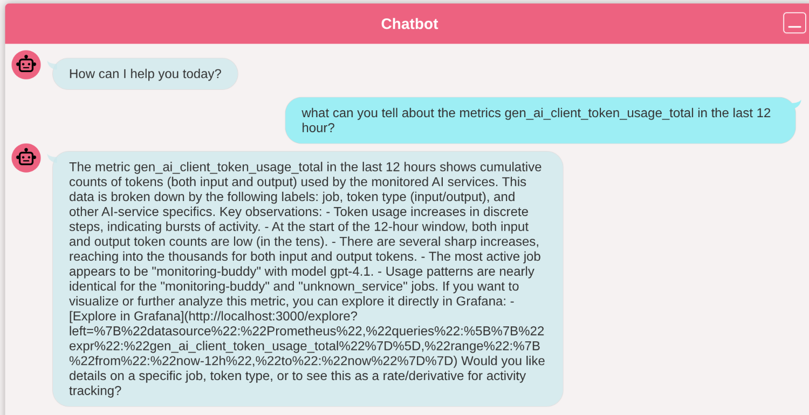

Together with my colleagues of OpenValue Utrecht we are having a hackathon at a nice place in the south of Belgium.       
It is pretty hot outside, but still we are having a lot of fun and learning a lot of new things.    
Each day there is a demo at the end, where key learnings are shared and the progress is shown. That is a great way to learn from each other and to get inspired by the work of others.

This is my working place during this hackathon:   
    
Looks like my own workplace at home, but now at different place.   

# Goals of the hackathon for me
The goal of the hackathon is to build a monitoring buddy, a chatbot that can help you with your monitoring and observability questions.

## Quarkus, LangChain4j, Tools and MCP in combination with Observability
As Java developer I also like to explore the possibilities of using [LangChain4j](https://langchain4j.io) to build a chatbot that can answer questions about monitoring and observability.   
The observability of the app itself is also something I want to explore for two reasons:   
1. I want to see what kind of requests are going back and forth between the chatbot and the LLM (Large Language Model) provider and the tools provided, to learn how the integration works.   
2. I want to see if I can build one or more dashboards to provide more insights into the chatbot's performance and usage.    
   This is a great way to learn how to use LangChain4j and how to build observability into these type of applications.   

Some references to get started:    
[https://code.quarkus.io/](https://code.quarkus.io/?g=nl.cbos&a=monitoring-buddy&e=io.quarkiverse.langchain4j%3Aquarkus-langchain4j-core&e=io.quarkiverse.langchain4j%3Aquarkus-langchain4j-chatbot&e=io.quarkiverse.langchain4j%3Aquarkus-langchain4j-mcp&e=io.quarkiverse.langchain4j%3Aquarkus-langchain4j-ollama&e=opentelemetry&e=observability-devservices)    
[Quarkus workshop LangChain4j](https://quarkus.io/quarkus-workshop-langchain4j/)

## Grafana and Tempo MCP
Grafana is building an [MCP](https://github.com/grafana/mcp-grafana) and also the team of Tempo is building an MCP endpoint on Tempo.   
I like to explore these MCPs and see how they can be used to retrieve data from Grafana, like the dashboards. But also telemetry data like logs, metrics and traces.

# Progress on Day 1

At first, I have created a Quarkus project with the LangChain4j dependencies and the OpenTelemetry dependencies.   
All source code is available on GitHub: https://github.com/cbos/monitoring-buddy   
The initial frontend code is a default generated Quarkus LangChain4j chatbot application.   
Adding an MCP is even just some configuration.

But I faced some problems as well. I added the [Grafana MCP](https://github.com/grafana/mcp-grafana) to my Observability Toolkit. That was not a problem, but for some reason LangChain4j was not able to properly communicate with the MCP.   
After trying a few things I decided to the go for the standard output integration. LangChain4J will start the docker image and do the communication standard input and output.    
Based on this I got it to work.

One of the things I learned is that MCP provided as a number of capabilities. These capabilities are send as tools to the LLM. The LLM can then use these tools to answer questions.

This is an example of the body send to the LLM in the first place:

```json
{
  "model" : "gpt-4.1",
  "messages" : [ {
    "role" : "system",
    "content" : "You are a monitoring buddy who can help to identify problems.\nYou are friendly, polite and concise.\nYou can answer questions about the monitoring system, and you can help to identify problems.\n\nYou know about the following tools:\nGrafana, Loki, Prometheus, Tempo.\nYou should use these tools to answer questions.\nGrafana MCP tool can be used to query Grafana dashboards and query prometheus and loki.\nThe Grafana server is available at http://localhost:3000 for the user, you can include that in the urls provided to the user.\nBe eager to suggest relevant dashboards or queries that can help the user to identify problems, especially 'explore' urls that can be used to explore the data in Grafana."
  }, {
    "role" : "user",
    "content" : "what can you tell about the metrics gen_ai_client_token_usage_total in the last 12 hour?"
  } ],
  "temperature" : 1.0,
  "top_p" : 1.0,
  "stream" : true,
  "stream_options" : {
    "include_usage" : true
  },
  "presence_penalty" : 0.0,
  "frequency_penalty" : 0.0,
  "tools" : [  {
    "type" : "function",
    "function" : {
      "name" : "list_prometheus_label_values",
      "description" : "Get the values for a specific label name in Prometheus. Allows filtering by series selectors and time range.",
      "parameters" : {
        "type" : "object",
        "properties" : {
          "datasourceUid" : {
            "type" : "string",
            "description" : "The UID of the datasource to query"
          },
          "endRfc3339" : {
            "type" : "string",
            "description" : "Optionally, the end time of the query"
          },
          "labelName" : {
            "type" : "string",
            "description" : "The name of the label to query"
          },
          "limit" : {
            "type" : "integer",
            "description" : "Optionally, the maximum number of results to return"
          },
          "matches" : {
            "type" : "array",
            "description" : "Optionally, a list of selectors to filter the results by",
            "items" : {
              "type" : "object",
              "properties" : {
                "filters" : {
                  "type" : "array",
                  "items" : {
                    "type" : "object",
                    "properties" : {
                      "name" : {
                        "type" : "string",
                        "description" : "The name of the label to match against"
                      },
                      "value" : {
                        "type" : "string",
                        "description" : "The value to match against"
                      },
                      "type" : {
                        "type" : "string",
                        "description" : "One of the '=' or '!=' or '=~' or '!~'"
                      }
                    },
                    "required" : [ "name", "value", "type" ]
                  }
                }
              },
              "required" : [ ]
            }
          },
          "startRfc3339" : {
            "type" : "string",
            "description" : "Optionally, the start time of the query"
          }
        },
        "required" : [ "datasourceUid", "labelName" ]
      }
    }
  },...


```
The Grafana MCP is providing quite a lot of capabilities. And that also causes some problems, you easily reach the maximum number of input tokens you can provide to the LLM, especially when you ask to retrieve the list of metrics for example.
To solve this, I disabled a number of capabilities which are not available in my local setup.    
`--disable-oncall,--disable-asserts,--disable-sift,--disable-admin,--disable-alerting,--disable-incident`

I configured the application in such a way that all metrics, logs and traces are sent to the OpenTelemetry collector, which is part of the Observability Toolkit.   
`gen_ai_client_token_usage_total` is one of the metrics.



The generated URL:   
http://localhost:3000/explore?left=%7B%22datasource%22:%22Prometheus%22,%22queries%22:%5B%7B%22expr%22:%22gen_ai_client_token_usage_total%22%7D%5D,%22range%22:%7B%22from%22:%22now-12h%22,%22to%22:%22now%22%7D%7D    
And when I opened this URL in Grafana, you can see what you can expect:
- The Grafana Explore view
- The right metrics directly selected
- And the time range set to the last 12 hours


As I am also interested in how it works under the hood and how you can make that observable, I configured the OpenTelemetry integration as well as mentioned before.
This is a trace of the requests to the LLM.


In this screenshot I highlighted a few things:
1. Request details to the LLM
2. The response type of the LLM, in this case `TOOL_EXECUTION`. The LLM requests my application to invoke a tool, in this case the Grafana MCP. That is all handled by LangChain4j.
3. You can see the second request to the LLM, the response of the MCP is included. It requested for the prometheus datasources. This was the extra details added:
`[{"id":2,"uid":"prometheus","name":"Prometheus","type":"prometheus","isDefault":true}]`
4. And finally a third request to the LLM.

As span attributes you can see the details as well:


I like the results so far. I got the integration to work and I learned a lot about LangChain4j and tools are integrated with LLMs.
The concept of MCP is very powerful and dangerous at the same time. 
If the MCP can manipulate data or even delete data, you have the risk that the LLM will request that and it is gone. 
At JCON 2025 I attended a nice talk about that by [Brian Vermeer and Lize Raes](https://schedule.jcon.one/session/781613), the recording is not available yet, but will be published on YouTube later. 