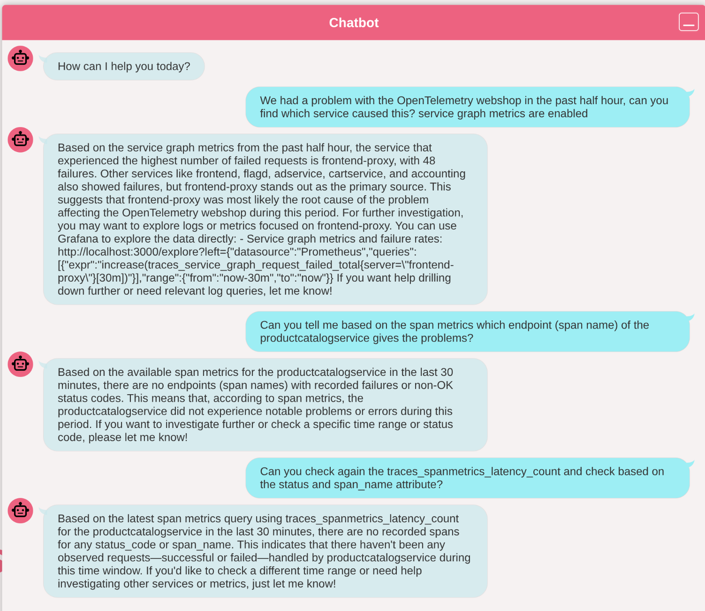

After a day of rest on Sunday, what I am used to have, I started the second day early. 

First idea to explore is what the combination Grafana MCP and LLM can do to help to find problems in the [OpenTelemetry Demo](https://opentelemetry.io/docs/demo/) setup.    

The OpenTelemetry Demo is a webshop with several services, like product catalog, checkout, ad service, etc, but all developed with a different programming language to showcase the capabilities of OpenTelemetry.    
This is a perfect use case to explore the capabilities of the Grafana MCP and LLM.

This setup includes a flagd service, which is a feature flag service. This service is used to enable or disable failures on request.    
I enabled one of the failures, so I could see if I could find the service that caused the problem.

I asked some more questions but I forgot to create a screenshot of the conversation, unfortunately.
But as I enabled the observability of my app, I still get the details from the logging and traces.

> We had a problem with the OpenTelemetry webshop in the past half hour, can you find which service caused this? service graph metrics are enabled

>
> "I could not find a Grafana dashboard specifically named "webshop" or "service graph." However, I found some relevant service graph metrics available in Prometheus, such as:
> 
> - traces_service_graph_request_client_seconds_bucket
> - traces_service_graph_request_client_seconds_count
> - traces_service_graph_request_client_seconds_sum
> - traces_service_graph_request_failed_total

Then I asked `- based on traces_service_graph_request_failed_total, can you tell which service it was?`

> Based on the traces_service_graph_request_failed_total metric, the "server" label indicates which service the failed requests targeted. The services recorded with failures are:
> 
> - accounting
> - adservice
> - checkoutservice
> - flagd
> - frontend
> - frontend-proxy
> - imageprovider
> - productcatalogservice
> If you’d like to see failure counts for a particular service or need to explore related data in Grafana, let me know and I can provide a ready-to-use dashboard link or query!"

So this is getting closer, but not the answer I hoped for. I wanted to know which service was the last in the chain of services that caused the problem.

So I tried it with some more details:   
`based on traces_service_graph_request_failed_total, can you tell which service it was? client label says which service send the request, server label which service handled the request. So there is a chain of services, can you give the chain and tell which one was the last in the chain with errors?`

The answer:
> "Based on the traces_service_graph_request_failed_total metric, here is the observed chain of failing requests (client -> server):
> 
> 1. user/loadgenerator/frontend-web → frontend-proxy → frontend
> 2. frontend → productcatalogservice, checkoutservice
> 3. checkoutservice → productcatalogservice
> 4. frontend-proxy → frontend
> 5. paymentservice/adservice → flagd
> 
> The final "server" in each chain represents the service where errors were last recorded. From the data, the last services in the chain with observed failed requests are:
> 
> - frontend
> - productcatalogservice
> - checkoutservice
> - flagd

At first the LLM did not came up with the answer I wanted. So I had to ask some more questions. That **came closer, but still not the answer I hoped for**.    
Hopefully with some more steering and input I will be be able to get the answer I hope.   
But first we had a break ...

# Break - climbing outdoor activity

As team outing activity we went to a place where we could go climbing.
Here are some pictures of me in action:

After a refreshment in the swimming pool after this activity, it was time to continue with the hackathon.

# Continuing with the hackathon

After the break I continued with the hackathon. Let's try to see what happens if I make the ['@SystemMessage'](https://docs.quarkiverse.io/quarkus-langchain4j/dev/ai-services.html#_system_message) instruction more specific.    
The OpenTelemetry Demo is running again and I toggled the flagd to introduce some failures in the 'product catalog service'.   
Let's see if my monitoring buddy can find the problem:    

So it can find some problems, but not the problem as I hoped for, even with the more specific instruction.   
Then I thought, let's try to steer the conversation even more with just providing a specific prometheus query:   

But even based on that, it not recognized it. Maybe this is because the status code is only on the query, but not in the response of the query.    

After a while I tried it again with asking the LLM if it could find the endpoint:

So in this attempt it was able to give the right answer.

Sending the right 'tool' request from the LLM back to the application is a key part of the process.    
If the requests are not correct, the LLM will not be able to find the right data. **Having the right insights in that process is crucial to steer the LLM in the right direction.**

At this moment it is quite some work to see which 'tool' requests have been asked for by the LLM and in the monitoring I cannot see the execution of the tool actions.
When I can see what kind of requests are send to request data from the tools, I can see if the LLM is using the right queries and if it is using the right data.
If that data in correct, then I might be able to steer the LLM with more background information. 

Next idea is I can make that more visible both in observability data and in the responses to the user.
