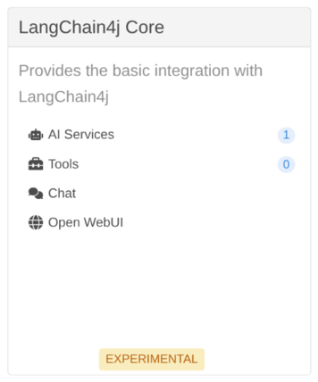
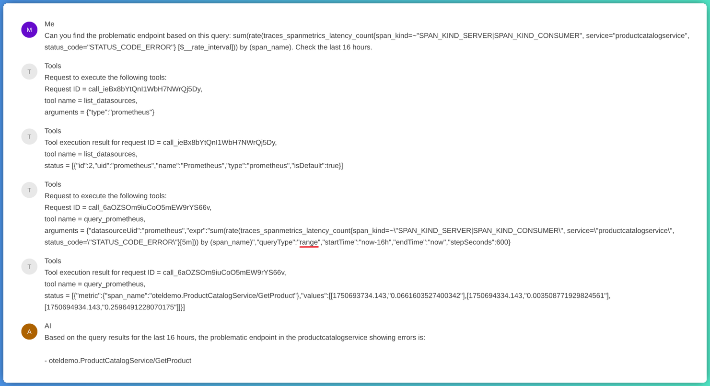
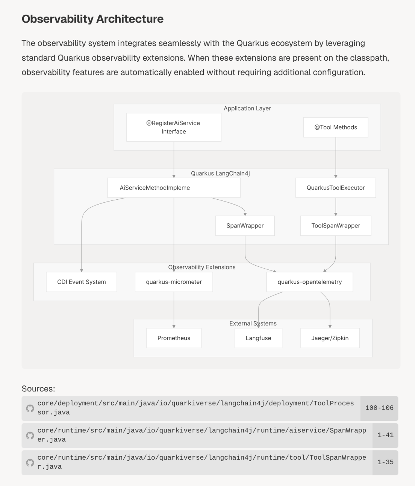
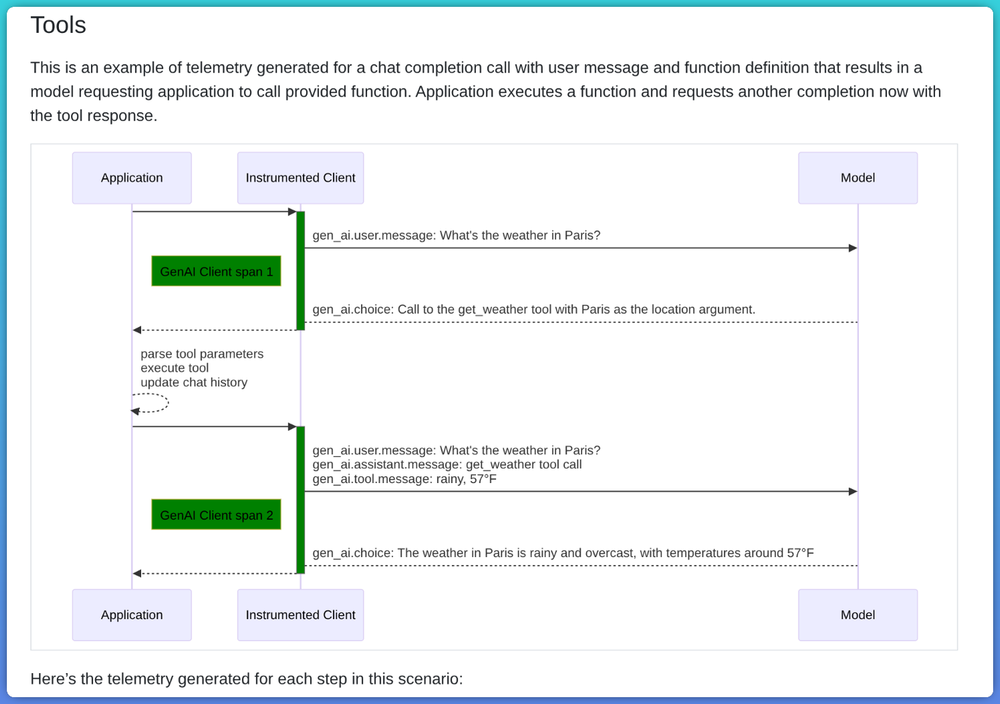
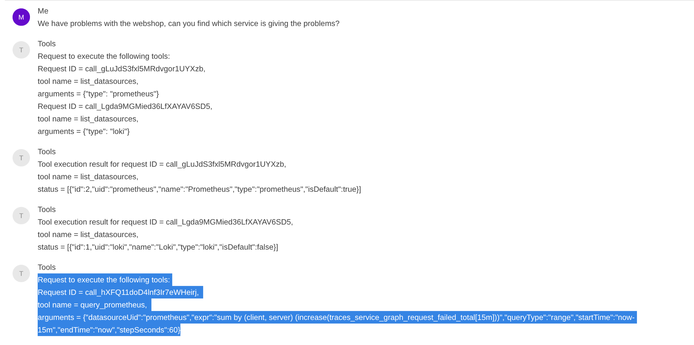
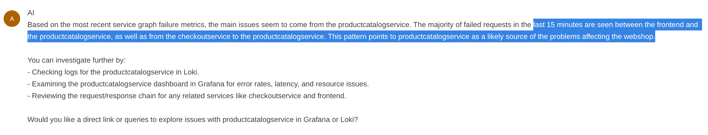
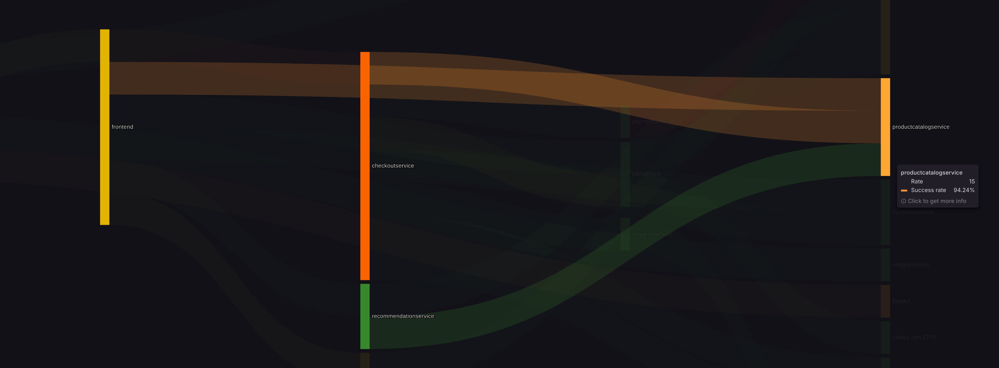
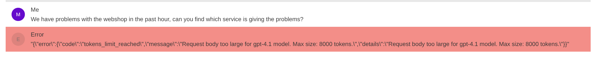

This is day 3 of the hackathon, the final day for me. Details of [day 1](../monitoring-buddy-hackathon-day-1) and [day 2](../monitoring-buddy-hackathon-day-2) are available as well.

The first step to more insights was easy. The Quarkus Dev UI has very useful features to explore the application.    
    
From there you can open the chat, which offers the **same functionality as the chat feature** of the chat starter application **and even more**.
[http://localhost:8081/q/dev-ui/io.quarkiverse.langchain4j.quarkus-langchain4j-core/chat](http://localhost:8081/q/dev-ui/io.quarkiverse.langchain4j.quarkus-langchain4j-core/chat) (NOTE: I changed the port to 8081, as the OpenTelemetry Demo setup is using port 8080 as well)   
On top there is the feature to enable `Show tool-related messages`, that shows the related to the tools, like the requests send to the Grafana MCP.


As highlighted in the screenshot, you can see here a 'range' prometheus query. But I also have seen some 'instant' queries as well. Both have their use cases, but I prefer the range queries as that provides more details which is needed in this type of analysis.

# What about the observability of the MCP requests?

In the Github repo of the [LangChain4j Quarkus](https://github.com/quarkiverse/quarkus-langchain4j) integration I found an interesting link to DeepWiki.    
I have not seen DeepWiki before, but that is really useful in this case.
- [DeepWiki](https://deepwiki.com/) is an AI-powered wiki generator that can create documentation based on the code and comments in the code.
- [DeepWiki - Why I Open Sourced an AI-Powered Wiki Generator](https://medium.com/@sjng/deepwiki-why-i-open-sourced-an-ai-powered-wiki-generator-b67b624e4679)
- [DeepWiki: Your AI-Powered Guide to GitHub Repositories](https://apidog.com/blog/deepwiki/)

This is the link to the DeepWiki page of the Quarkus LangChain4j integration and observability:
- [DeepWiki - Quarkus LangChain4j](https://deepwiki.com/quarkiverse/quarkus-langchain4j/12-observability)


In this diagram you can see who the `@RegisterAIService` and `@Tool` annotations are handled and these handlers register wrappers to produce spans for the chat messages and the tool calls.       
But the **integration with MCP is not yet implemented**, that answers the question why I don't see the MCP actions being visible as spans.    
The `ToolSpanWrapper` only registers the tool execution itself, but does not log details about the request from the LLM to the Tool.

And while going through the code, I found that only 4 days ago commit has been done to add tracing support for the MCP requests in the main branch. This is not yet released.    
https://github.com/quarkiverse/quarkus-langchain4j/commit/dbd75598c8e1d9fb5ca96f253b7a029ee2bdb652    
This commit helps to get spans for MCP requests, but will not have details yet.

## Semantic Conventions of GenAI and Tools
OpenTelemetry Conventions support tools integration and also have described how to add the data to the spans for Tools.   
https://opentelemetry.io/docs/specs/semconv/gen-ai/gen-ai-events/#tools

So the conventions support more details about the tools integration.

The OpenTelemetry community is also working on MCP semantic conventions: https://github.com/open-telemetry/semantic-conventions/issues/2043   
Once that is available, Quarkus LangChain4j integration can adopt that as well, that can help to get more insights.

For now I know how I can see which requests are send back and forth between the LLM and the MCP, based on the Quarkus Dev UI.    
The observability of it in logs and spans is not optimal yet, but that is work in progress, which is good news!    

# Next attempts

Based on what I saw before, I updated the `@SystemMessage` with some more details:
> When doing Prometheus queries, prefer 'range' queries over 'instant' queries, as they provide more context.

Again I ran the OpenTelemetry Demo setup and tried to ask some questions again:



The Prometheus query is a proper range query, which in itself provides good information.

And based on this data the LLM is able to give a proper analysis. 

In a service graph visualisation you can see that indeed the `frontend` service and `checkoutservice` sending messages to the `productcatalogservice` service, which is the service that has the problems.

## But is this result consistent?

Is the analysis consistent if we ask it again?

So I asked the same question again, but now it gave an error. And this UI does not show the tool requests in case an error occurs, that does not help in the analysis. (NOTE: I logged a ticket to get this data available as well in the UI: https://github.com/quarkiverse/quarkus-langchain4j/issues/1577)   
In the logging in Loki I found the tool request send by the LLM:
```json
{
  "function": {
    "arguments": "{\"datasourceUid\":\"prometheus\",\"expr\":\"traces_service_graph_request_failed_total\",\"queryType\":\"range\",\"startTime\":\"now-1h\",\"endTime\":\"now\",\"stepSeconds\":60}",
    "name": "query_prometheus"
  },
  "id": "call_0x3jfUDXXeh7hVSRXkljhpJW",
  "type": "function"
}
```
This gives more data. That data is sent to the LLM back, but that request is too big and exceeds the limit of 8000 input tokens. 

So as soon as the LLM has the right data, it can come up with a proper answer.     
But requesting that data in the right way is a challenge.    
Running a local LLM might help to overcome some limits, but it takes more resources as well locally and is not default either. 

# My conclusion based on this hackathon

The hackathon was a great experience to learn more about the LangChain4j integration with Quarkus and how it can be used to build a monitoring buddy. 
But I don't have my buddy yet 😉

I learned a lot about Quarkus LangChain4j and it's observability features and how that can be further improved.   
Also the way MCP's can be used and how the LangChain4j integration is working. MCP capabilities are in the end provided as 'tool' capabilities in the integration with the LLM.

You can give the LLM guidance with the `@SystemMessage`, without that guidance the LLM is having a hard time to find the right data.
But even with more guidance, the way the LLM is requesting the data differs per run. 
Having the right observability data is crucial to get to the right answers. 

With the right dashboard or Grafana plugin, you can still get same or even better insights at a glance. The difference is that you need to be able to interpret the dashboard or plugin, while the LLM can give you the answer in human readable text.
Something I did not test is, if you have a dashboard with the right data, can you ask the LLM to interpret that data? And can it give you the right answer based on that data?

