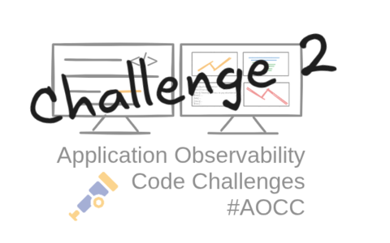
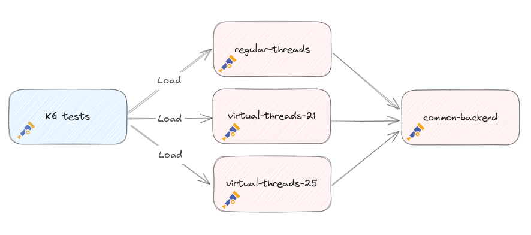

After I released the [first challenge](../aocc-challenge-01), I got quite a lot of enthusiastic reactions from developers who were interested in doing the challenge.
But I also noticed that it was sometimes quite hard to find the cause of the problem. Therefore it is a challenge, right? 
This time the issue is easier to find, which you can even spot just by looking at the code. But this time the question is can you spot this problem based on the observability data?   
And especially **can you spot the problem when virtual threads** are being used? And can you find the **differences between Java 21 and Java 25** when using virtual threads?

### 🔍 The Challenge
- Run the sample applications `regular-threads` and `virtual-threads-21` and `virtual-threads-25`
- Run the tests to see what happens
- Try to find out what happens, make a hypothesis❗
- **Improve the observability** of the application to **prove the hypothesis**
- Optional: fix the problem and **prove it with observability data that it is really fixed**
- Optional, but highly appreciated 🙏: Share your findings, insights you learned and potential solution, either as a ['discussion'](https://github.com/cbos/application-observability-code-challenges/discussions) or as a pull request

### 🛠️ How to Get Started
All the details you need to jump in can be found here:   
👉 [https://github.com/cbos/application-observability-code-challenges/tree/main/challenge-02](https://goto.ceesbos.nl/ghch02)   
Prefer an online environment? No problem! Use KillerCode to get started with just a few clicks:   
👉 [https://killercoda.com/observability-code-challenges](https://goto.ceesbos.nl/aocckk)

### Challenge details

- The setup contains 4 applications:
  - `common-backend`: A common backend used by three other applications
  - `regular-threads`: A version of the application with **Java 21** and using **regular threads** to execute the requests
  - `virtual-threads-21`: A version of the application with **Java 21** and using **virtual threads** to execute the requests
  - `virtual-threads-25`: A version of the application with **Java 25** and using **`Virtual Threads`** to execute the requests
- The applications are instrumented using **OpenTelemetry** auto instrumentation.
- You can either run the application with Docker or directly.
- Pre-configured **K6 load scripts** to simulate traffic and reveal performance bottlenecks.
- You can use the **pre-configured [Observability Toolkit](../observability-toolkit)** or you can use **your own Observability stack**

The setup looks like this:

Goals for this challenge:
1) Check if you can find the Java version in the observability data (logs, metrics, traces)
1) Can you spot the latency gap between the services in traces?
1) Can you find the problem based on metrics?
1) And the most important: Can you see the difference between the 3 application `regular-threads` and `virtual-threads-21` and `virtual-threads-25`?
2) What can be done to make it more observable?

👉 Go to the challenge: [https://github.com/cbos/application-observability-code-challenges/tree/main/challenge-02](https://goto.ceesbos.nl/ghch02)

### Feedback?

If you have any feedback, please let me know. You can leave a comment below, send me a message on [Bluesky](https://bsky.app/profile/ceesbos.nl), [Mastodon](https://foojay.social/@cbos), [LinkedIn](https://www.linkedin.com/in/ceesbos/) or in the ['discussion'](https://github.com/cbos/application-observability-code-challenges/discussions) section of the challenge's Github repository .

