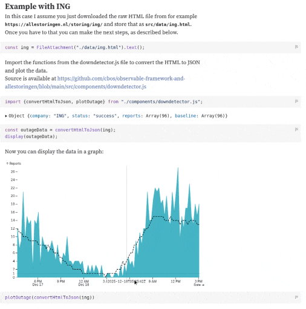
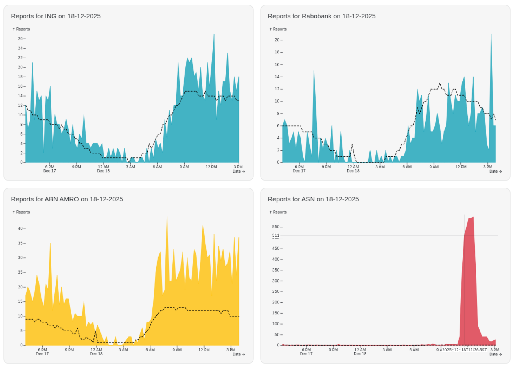

## Reports for incident analysis

When you face an incident it is good to make an incident report to see if you can find the root causes of it and describe actions to prevent it next time.
Such a report has roughly the following structure:
- What happened?
- What has been done to mitigate the issue?
- What can be done to prevent it from happening again?

I have seen quite some reports where the first part was only a short description without details.
Then you have to trust the authors of the report that the described improvement actions are sufficient to prevent it next time.

## Describe 'what happened' in a 'scientific paper' approach

In order to judge whether the actions taken are sufficient to prevent the incident from happening again, you have to analyze the incident data.
The observability data is an excellent source for that, but that data is sometimes scattered across different tools and systems, not everyone has access and you have to interpret that data as well.

During the analysis sessions I did, I captured this on a Confluence page. I stored screenshots and links to some dashboards.
Next to that I wrote my observations and the relation between the captured screenshots, like I did in a blog post like this [one](../aocc-challenge-01-step-by-step).

The reason why I take this approach is that it is **easy to reproduce the analysis** and I can **share my line of thinking** with others.
And if others disagree or have a different view, or maybe they have more data, this document is a source to have a discussion.
If you are able to understand all details of an incident together, you can better come to a conclusion and have better actions to prevent it next time.

Capturing data on a page has some drawbacks:
- Screenshots are not interactive
- Dashboard links are fine, but the link is sometimes to the 'last 24 hours', which is not applicable if you read it later
- Observability data might already be deleted due to retention policies

## Interactive reports

To share the analysis, you can create a report with captured observability data and which is interactive as well.   
[Observable Framework](https://observablehq.com/framework) provides a simple way to build interactive data reports.

> **_What is Observable Framework?_**   
> 
> Create fast, beautiful data apps, dashboards, and reports from the command line. Write Markdown, JavaScript, SQL, Python, R… and any language you like. Free and open-source.
> 
> _source:_ _[Observable Framework](https://observablehq.com/framework)_

The engineers of Observable Framework created a framework to create reports and provided an example of that as well:   
   
See [Analyzing web logs](https://observablehq.observablehq.cloud/framework-example-api/)

It is also very easy to get started: https://observablehq.com/framework/getting-started   
And with the Observable Framework, you can use the [Observable Plot library](https://observablehq.com/plot/) to easily create graphs

## Observable Framework + DownDetector 

When an incident occurs, customers report problems pretty quickly. [DownDetector](https://downdetector.com) and [Allestoringen](https://allestoringen.nl) provide a nice overview of the problems.   
That data can be a starting point for your own incident report to indicate the customer impact.

I created a [sample repository](https://github.com/cbos/observable-framework-and-allestoringen) with an example interactive report which is available at:
[https://ceesbos.nl/observable-framework-and-allestoringen/](https://ceesbos.nl/observable-framework-and-allestoringen/)

The example looks like this, including the instructions on how to use it:   

And a part of an actual report can look like this:   

## What is next?

I have quite some ideas in mind how this can be used even more. I use Grafana a lot, and I see a lot of potential in combining Grafana and Observable Framework or Observable Notebook to create interactive incident reports.