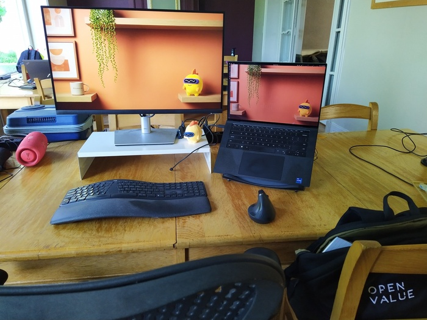
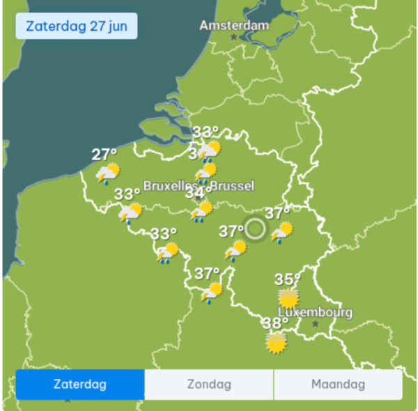

Together with my colleagues of OpenValue Utrecht we are having again a hackathon. This time in the east of Belgium, but again it is hot and sunny outside.   
Temperature inside is also 30+ degrees ... that is pretty tough to keep going. But that gives nice moments to relax and enjoy the conversations with my colleagues.   


   


## Goal of my hackathon
We can choose whatever we want to learn and practice to improve our skills, knowledge and experience.   
For me this hackathon has multiple goals. On one hand, I want to learn more and get more hands-on experience with AI tooling.   
The current project I am working on restricts AI usage, so this is a good opportunity to learn more about AI and also how it can be used in the context of Grafana.   
That brings me to the second topic; I want to learn more about the latest developments of Grafana about the `gcx` tool and `Observability as code`, mainly the foundation SDK.    

### AI-accelerated development training in the morning

In the morning we had a session on AI-accelerated development training, which Tom Wigleven normally gives as [OpenValue training](https://openvalue.training).   
A really insightful session about AI agents, skills, Openspecs, guardrails and how to be in control as an engineer.   
When I commit the code, as an engineer, I'm responsible, I can't blame the AI agent. I will be called on incidents, not the AI agent.

### gcx after lunch

Due to the heat outside, my activity in the afternoon was at a lower pace.    
First, I had to update some of the tools I usually use, including the [Observability Toolkit](https://github.com/cbos/observability-toolkit).   
I have updated all components to the latest version.

Next I started to play around with the `gcx` tool. I had to install it.
You can follow the usual steps to install gcx at [Grafana gcx documentation](https://grafana.com/docs/grafana/latest/as-code/observability-as-code/grafana-cli/gcx/installation/)
But I configured my systems with [Chezmoi](https://www.chezmoi.io), so I updated my config:   

```toml
[".local/bin/gcx"]
    type = "archive-file"
    url = {{ gitHubLatestReleaseAssetURL "grafana/gcx" (printf "gcx_*_%s_%s.tar.gz" .chezmoi.os .chezmoi.arch) | quote }}
    refreshPeriod = "168h"
    executable = true
    path = "gcx"
```
And I updated my ZSH configuration to get the `gcx` autocompletion:

```zsh
  # load gcx completion
  if [ "$(command -v gcx)" ]; then
  source <(gcx completion zsh)
  fi
```

After running `chezmoi update` and opening a new terminal, gcx worked with completion in my terminal.

```shell

gcx version
┌───────────────────────────────────────────────────────────────────┬───────────────────────────────────────────────────┐
│ FIELD                                                             │ VALUE                                             │
├───────────────────────────────────────────────────────────────────┼───────────────────────────────────────────────────┤
│ Version                                                           │ 0.4.1                                             │
│ Commit                                                            │ a0c0681555e20a37d02480107eda048cb3e1dbdc          │
│ Build Date                                                        │ 2026-06-24T09:34:05Z                              │
│ Go                                                                │ go1.26.2                                          │
│ OS                                                                │ linux                                             │
│ Arch                                                              │ amd64                                             │
└───────────────────────────────────────────────────────────────────┴───────────────────────────────────────────────────┘


```

### Connect gcx to a local Grafana setup

So let's try if I can connect it to my local Grafana setup.
For authentication, I use a [Grafana Service Account](https://grafana.com/docs/grafana/latest/administration/service-accounts/) which I mentioned before as well in [Grafana as proxy](../grafana-as-proxy)

```shell
gcx config set contexts.default.grafana.server http://localhost:3000

# This is needed for OSS to explicitly set the org id
gcx config set contexts.default.grafana.org-id 1


# For authentication sign in with a service account token
gcx config set contexts.default.grafana.token glsa_....
```

Now let's see if this is working. 


```shell
 gcx dashboards list
┌────────────────────────────────────┬──────────────────────────────────────────┬───────────┬───────────────────────────────────────────────┬────────┐
│ NAME                               │ TITLE                                    │ FOLDER    │ TAGS                                          │ AGE    │
├────────────────────────────────────┼──────────────────────────────────────────┼───────────┼───────────────────────────────────────────────┼────────┤
│ edy6473ay1vk0a                     │ Quarkus Micrometer OpenTelemetry         │ General   │ Quarkus, Micrometer, OpenTelemetry, metrics   │ 423d   │
│ edy6473ay1vk0b                     │ Quarkus Micrometer Prometheus registry   │ General   │ Quarkus, Micrometer, Prometheus, metrics      │ 423d   │
│ edy6473ay1vk0c                     │ Quarkus Micrometer OTLP registry         │ General   │ Quarkus, Micrometer, OTLP, metrics            │ 423d   │
│ fRIvzUZMzTES1                      │ Quarkus OpenTelemetry Logging            │ General   │ Quarkus, OpenTelemetry, logging               │ 423d   │
│ febljk0a32qyoa                     │ Lightweight APM for OpenTelemetry        │ General   │                                               │ 413d   │
│ febljk0a32qyoa-new                 │ Lightweight APM for OpenTelemetry-new    │ General   │                                               │ 3d     │
│ o11ytk-k6-load-test                │ K6 Load Test                             │ General   │                                               │ 528d   │
│ o11ytk-service-details             │ Service details                          │ General   │ JVM, HTTP, OpenTelemetry                      │ 528d   │
│ observabilitystackOtelCollector    │ OpenTelemetry Collector                  │ General   │ opentelemetry                                 │ 528d   │
│ opentelemetry-apm                  │ OpenTelemetry APM                        │ General   │                                               │ 3d     │
└────────────────────────────────────┴──────────────────────────────────────────┴───────────┴───────────────────────────────────────────────┴────────┘
```

So this works as expected.

Now I want to connect it to my Grafana Cloud setup as well.

```shell
gcx config set contexts.cb-cloud.cloud.token glsa_...
```

```shell
gcx config list-contexts                                                                   
┌───────────────────┬─────────────────────────────────┬──────────────────────────────────────────┐
│ CURRENT           │ NAME                            │ GRAFANA SERVER                           │
├───────────────────┼─────────────────────────────────┼──────────────────────────────────────────┤
│ *                 │ default                         │ http://localhost:3000                    │
│                   │ cb-cloud                        │                                          │
└───────────────────┴─────────────────────────────────┴──────────────────────────────────────────┘

```

Now I switch to the `cb-cloud` context and try to list dashboards.

```shell
# Switch to the cloud context
gcx config use-context cb-cloud

# Let's try to list the dashboards
gcx dashboards list            
Error: Invalid configuration
│
│ Invalid configuration found in '':
│ grafana config is required
│
├─ Suggestions:
│
│ • Review your configuration: gcx config view
│
└─
```
Hmm, this is not working yet. Let's review the configuration.

```shell
gcx config check
✔ Configuration file: /var/home/cbos/.config/gcx/config.yaml
✔ Current context: cb-cloud

Context: cb-cloud
=================
✘ Configuration: Invalid configuration: grafana config is required
⚠ Connectivity: skipped
⚠ Grafana version: skipped

🛈 Suggestions:

  • Review your configuration: gcx config view

Context: default
================
✔ Configuration: valid
🛈 Auth method: token (inferred)
🛈 Context type: On-prem
✔ Connectivity: online
✔ Grafana version: 13.1.0
```

This shows it cannot connect to the Grafana Cloud, but it is not helpful what is missing.

I found out that I made some configuration mistakes, the `cloud` section is for accessing the Grafana Cloud stack settings, not the Grafana Cloud instance.
So I updated the configuration:

```shell
gcx config set contexts.cb-cloud.grafana.server https://cbos.grafana.net
gcx config set contexts.cb-cloud.grafana.token glsa_...

# check again
gcx config check
✔ Configuration file: /var/home/cbos/.config/gcx/config.yaml
✔ Current context: cb-cloud

Context: cb-cloud
=================
✔ Configuration: valid
🛈 Auth method: token (inferred)
🛈 Context type: Grafana Cloud
✔ Connectivity: online
✔ Grafana version: 13.1.0-27720614980

Context: default
================
✔ Configuration: valid
🛈 Auth method: token (inferred)
🛈 Context type: On-prem
✔ Connectivity: online
✔ Grafana version: 13.1.0
```

Now it is connected with both my Grafana Cloud and my local Grafana setup.

Now I switch back to the `default` context and try to pull the dashboards as resources:

```shell
gcx resources pull dashboards -p resources/dashboards
✔ 3 resources pulled, 0 errors
```

Here you see it pulled 3 resources, but that is not the number of dashboards I expected, as I have more in the Observablity Toolkit, but these are managed in the deployment.    

```shell
gcx resources pull dashboards -p resources/dashboards --include-managed 
✔ 10 resources pulled, 0 errors
```

That is what I expected.

To finish this blogpost, I created a new SKILL in my repo for my blogpost. That will help to practice my AI skills as well.

In my Claude session:
` can you review my latest post with /write-simply and suggest changes`

```shell

● I'll read your latest post and then use the /write-simply skill to review it.

  Read 1 file (ctrl+o to expand)

● Skill(write-simply)
  ⎿  Successfully loaded skill

● Here are the key areas where your post can be tightened up according to write-simply principles:

  Major Issues

  1. Title typo: "Observabilty" → "Observability"
  2. Missing summary ...
...
```

This is useful to have it reviewed and correct spelling and grammar where needed.   

### Goal for the next day

On [Devoxx](../../talks/2025-devoxx-belgium) and [JCON](../../talks/2025-jcon) I have talked about issues in applications had how you can find these problems with Grafana.    
I am curious if Claude and `gcx` these problems can be found as well and if these problems can be solved.   
Some holds for the [Application Observability Code Challenges](../application-observability-code-challenges). I am curious what the results will be.