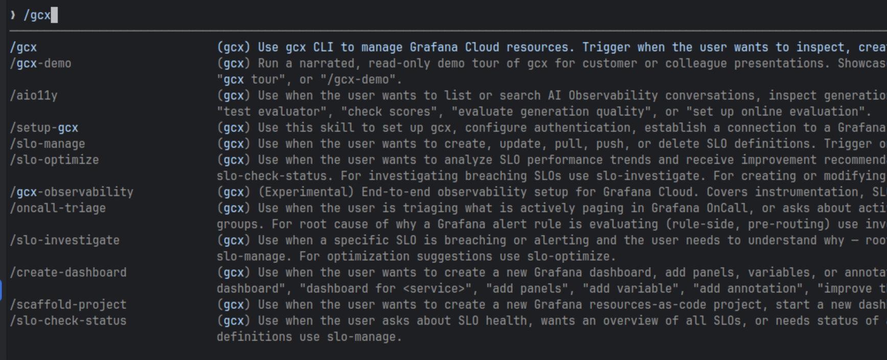
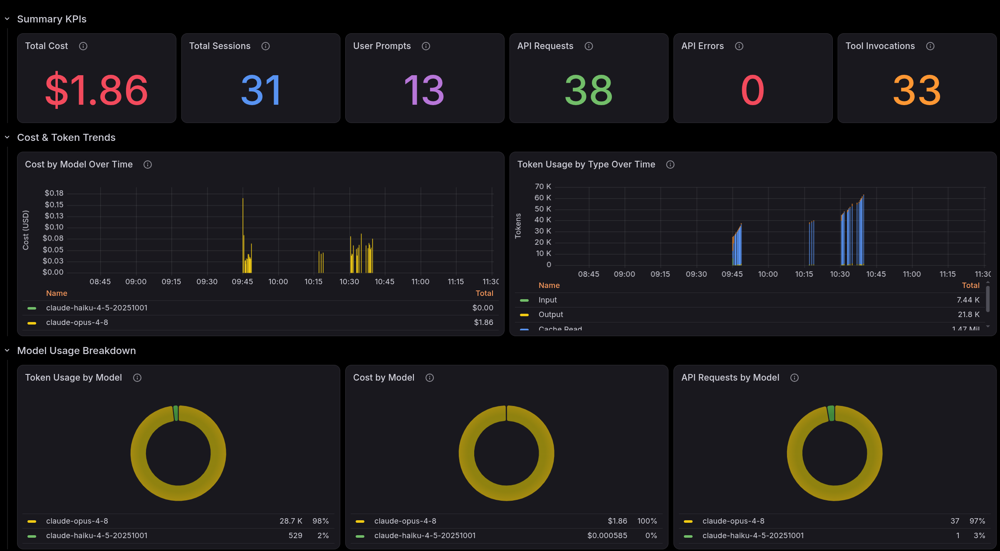
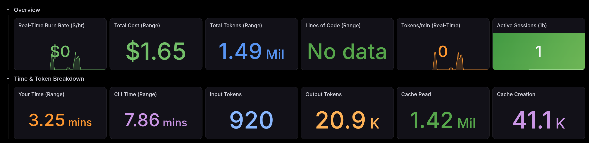
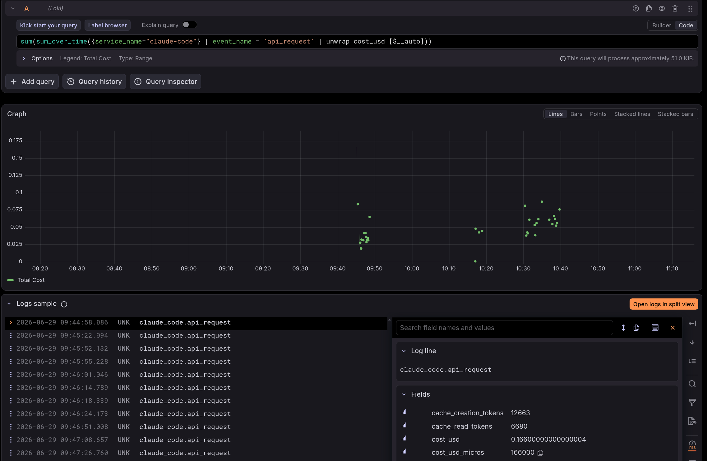
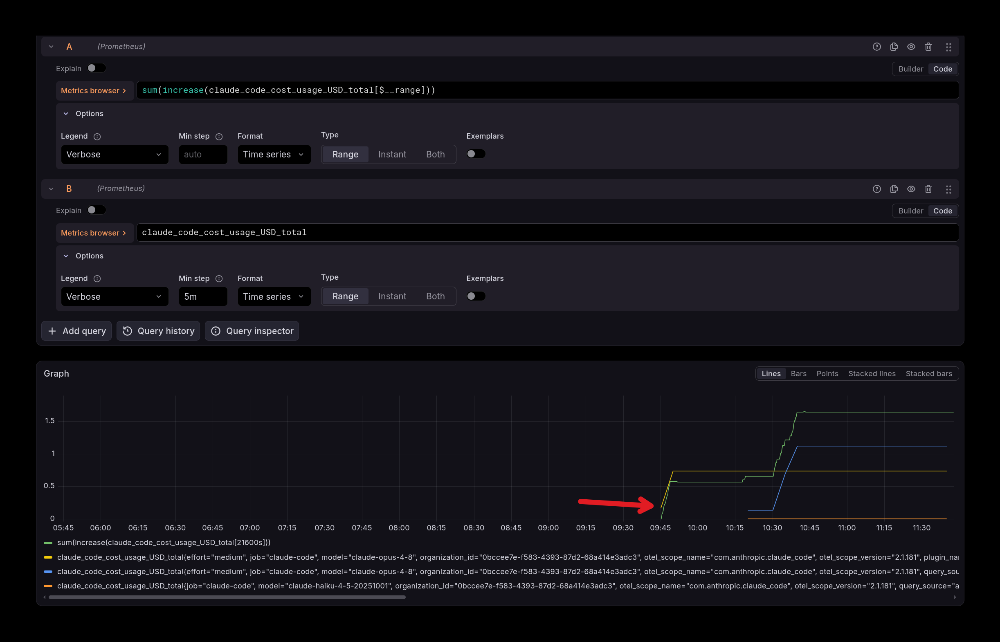
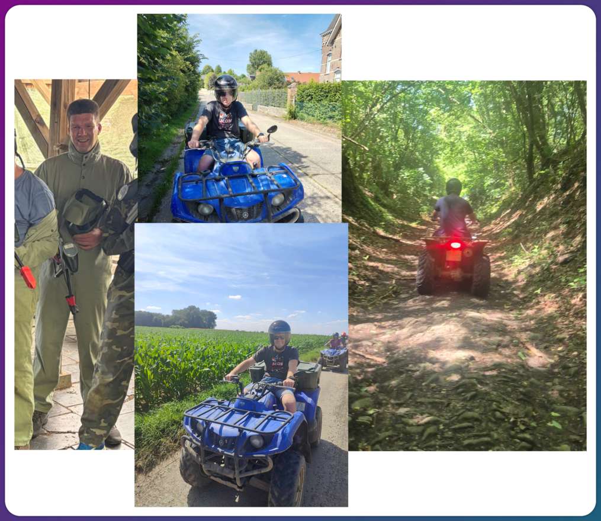

## Goals for today

For me the second day of the hackathon was a fresh start, with a lower temperature too. I want to learn a number of things today.
- Usage of Claude agents and skills in combination with Observability  
- See how Claude is working in the background  
- I am curious whether AI can help to analyze issues with code

On [day 1](../observability-and-ai-hackathon-day-1) I installed Grafana `gcx`. Now I want to learn how to use it in combination with AI.


### Claude observability with OpenTelemetry and Grafana

Before actually starting with this, I thought: "Is there a way I can see what Claude is doing, how many requests are sent, how many tokens are used, etc?"   
I found some blogs about that [[1]](https://tcude.net/how-i-monitor-my-claude-code-usage-with-grafana-opentelemetry-and-victoriametrics/) [[2]](https://braw.dev/blog/2026-03-28-monitor-claude-usage-with-grafana/)   
Based on this, I will change my Claude settings to use OpenTelemetry and I will see over time how that works out.    
I have my [Observability Toolkit](../observability-toolkit) running with an OpenTelemetry Collector, Loki, Tempo, Prometheus and Grafana. So let's push the OpenTelemetry data to my local stack.

```json

{
  "env": {
    "CLAUDE_CODE_ENABLE_TELEMETRY": "1",
    "CLAUDE_CODE_OTEL_FLUSH_TIMEOUT_MS": "1000",
    "OTEL_METRICS_EXPORTER": "otlp",
    "OTEL_LOGS_EXPORTER": "otlp",
    "OTEL_TRACES_EXPORTER": "otlp",
    "OTEL_EXPORTER_OTLP_PROTOCOL": "grpc",
    "OTEL_EXPORTER_OTLP_ENDPOINT": "http://localhost:4317",
    "OTEL_EXPORTER_OTLP_METRICS_TEMPORALITY_PREFERENCE": "cumulative",
    "OTEL_METRIC_EXPORT_INTERVAL": "1000",
    "OTEL_LOGS_EXPORT_INTERVAL": "5000",
    "BETA_TRACING_ENDPOINT": "http://localhost:4318",
    "CLAUDE_CODE_ENHANCED_TELEMETRY_BETA": "1",
    "ENABLE_BETA_TRACING_DETAILED": "1"
  },
  ...
}

```

During the day, I will see what this data will tell me about Claude's usage and share some insights based on that (hopefully).

### Grafana gcx skills

As described in the Grafana gcx [documentation](https://github.com/grafana/gcx/blob/main/README.md#install-agent-skills) I will install the Claude plugin to be able to use the skills.

```shell
/plugin marketplace add grafana/gcx                                                                                                                                                                                                                                                                                                                                                                                          
 ⎿  Successfully added marketplace: gcx-marketplace

/plugin install gcx@gcx-marketplace                                                                                                                                                                                                                                                                                                                                                                                          
 ⎿  ✓ Installed gcx. Run /reload-plugins to apply.

# now I have to reload the plugins
/reload-plugins                                                                                                                                                                                                                                                             
```



These skills can be used to query Grafana. It helps to define the default Prometheus, Loki and Tempo datasources. 

```shell
gcx datasources list

# Based on the UIDs listed with the above command, I can define the default datasources
gcx config set contexts.default.default-prometheus-datasource prometheus
gcx config set contexts.default.default-loki-datasource loki
gcx config set contexts.default.default-tempo-datasource tempo
```

### "Solving problems with OpenTelemetry - part 1" 

During my presentation at [Devoxx](../../talks/2025-devoxx-belgium) and [JCON](../../talks/2025-jcon) I showed some scenarios where you can see problems and where you can do analysis to find out where the problems occur.   
Code and K6 scripts are available at: https://github.com/cbos/solving-problems-with-opentelemetry

I have started the services and triggered the second K6 run with `just k6-scenario-2`   
In the Grafana dashboard you can see the results.

Now I started a session with Claude with the `debug-with-grafana` skill

```shell
 /gcx:debug-with-grafana it seems that service alpha and beta have issues 
```


The output showed messages like:
```shell
● Datasources found: Prometheus, Loki, Tempo. Now let me confirm the services exist and are being scraped.

● Bash(echo "=== UP for alpha/beta ==="; gcx metrics query -d prometheus 'up{job=~"alpha|beta"}' -o json 2>/dev/null ...

● up is empty for these jobs (likely OTel push-based, not scraped), but alpha and beta exist as job labels. Let me discover what metrics are available for them.
```
So it tried to find the first status based on the `up` metric.
After some more queries it came with these messages:

```shell

● Bash(for svc in alpha beta; do
echo "=== $svc metric names ==="…)
 ⎿  === alpha metric names ===
       http_server_request_duration_seconds_bucket
       http_server_request_duration_seconds_count
  … +25 lines (ctrl+o to expand)

● These are Spring Boot/Tomcat Java services with OTel-style metrics. Let me check the labels (status code) and query error rates.
```
And in the end the final conclusion:

```shell

● I have a complete diagnosis. Here's the summary.

  Diagnosis: services alpha and beta

  Time window: last 1h (to 2026-06-29) · Datasources: Prometheus, Loki, Tempo

  Both services are behaving identically — same app (otel-demo-application.jar, package nl.cbos.simpleapp), same symptoms.

  Error signal

  - ~30% of all requests return HTTP 500 on both services (≈2.8 req/s of 9.3 req/s total).
  - Error rate is climbing over the window (1.44 → 2.82 req/s).
  - All 500s are isolated to a single endpoint: /random/{id}. The / route is healthy (0 errors).

  Latency signal

  - /random/{id} P95 ≈ 0.82s on both (the failing requests take ~420ms each).
  - / route is sub-5ms. Latency is elevated only on the failing endpoint — this is a fail-with-delay, not a slowdown that precedes errors.

  Log evidence (Loki, label service_name)

  Identical recurring exception on both services (~25x each in 30m):
  Servlet.service() for [dispatcherServlet] threw exception
  [Request processing failed: java.lang.RuntimeException: Something went terribly wrong]

  Trace evidence (Tempo)

  - Root span GET /random/{id}, http.response.status_code = 500, error.type = 500.
  - Exception event: RuntimeException: Something went terribly wrong thrown from nl.cbos.simpleapp.controller.SimpleRequestHandler.randomBehaviour.
  - No downstream calls in the trace — the error originates inside the service itself, not a shared dependency.
  - Traffic source is Grafana k6/2.0.0 (a load generator).

  Likely root cause
  
  This is intentional, application-level behavior, not an infrastructure failure. The randomBehaviour handler on /random/{id} deliberately throws a RuntimeException for a fraction of requests (a classic
  OTel demo app). Because alpha and beta run the same image driven by the same k6 load test, they show identical ~30% error rates. The "issue" is the demo app working as designed under load — not a
  dependency outage, resource exhaustion, or a service being down (note: there is no up metric for these jobs; they're OTel push-based, so they were never down).

  Recommended next actions

  1. If this is expected demo traffic — no action needed; the 500s are synthetic. You may want to exclude /random/{id} from error-budget/alerting so it doesn't generate noise.
  2. If you want to silence it — reduce the k6 error-injection rate or point load away from /random/{id}.
  3. If you genuinely expected these endpoints to succeed — fix SimpleRequestHandler.randomBehaviour in the nl.cbos.simpleapp code; that's the only place generating the exception.

  Want me to check for any firing alert rules tied to these services, or pull a dashboard snapshot for a visual?
```

This conclusion of the AI is correct, but it actually only told me the same thing: these services have issues, and it tells which issues, but it did not investigate in which situations they failed, so what the actual cause is. Without knowing the cause, it is hard to fix it. 
So let's ask a follow-up question:

```shell
The conclusion is correct, can you tell me the pattern for which these requests fail?
``` 
```shell
● Good question — the metric labels collapse the id into /random/{id}, so I need the raw url.path from traces. Let me pull the actual ids for failing vs succeeding requests.
...

● The search results don't include url.path — I need to fetch each trace. Let me extract ids from a batch of failing and OK traces.
...
● Clear, deterministic pattern — and the two sets don't overlap at all.

The failure pattern

Requests to /random/{id} fail based on the id value, deterministically:

┌──────────────────────┬────────────────────────────────┐
│          id          │             Result             │
├──────────────────────┼────────────────────────────────┤
│ 1, 2, 3              │ ❌  HTTP 500 (RuntimeException) │
├──────────────────────┼────────────────────────────────┤
│ 4, 5, 6, 7, 8, 9, 10 │ ✅  HTTP 200                    │
└──────────────────────┴────────────────────────────────┘

The failing set {1,2,3} and the succeeding set {4–10} never overlap across the ~50 traces sampled — the same id always produces the same outcome. So despite the endpoint being named /random/,
the failure isn't random at all: a request fails when id ≤ 3 (the handler throws Something went terribly wrong for the low ids).

This also explains the steady ~30% error rate: k6 drives ids 1–10 roughly uniformly, and 3 of those 10 values always error → ~30%. Both alpha and beta share the identical threshold since they
run the same nl.cbos.simpleapp image.
```

This is the correct conclusion, the original code shows:

```java
    private boolean handleRequest(int id) throws InterruptedException {
        Thread.sleep((long) (Math.abs((random.nextGaussian() + 1.0) * 300.0)));
        // mark fine when id is bigger then 3
        return id > 3;
    }
```


### "Solving problems with OpenTelemetry - part 2"

As a second part, I will explore whether it can find the problems in a different scenario.        
To start the next scenario, I will run `just k6-scenario-3` which sends again requests to the services.   

Now I will ask Claude if it can find the problems (in the same session as before)

```shell
there is a different problem now, service beta is very slow can you find out why?  
```

```shell
● Found it — beta has a /chain/{id} route with P95 ≈ 10s that doesn't exist on alpha. Let me trace it to see what it's waiting on.

● Let me find the genuinely slow ones (duration > 5s) and inspect the span structure.

● Bash(id=$(gcx traces query -d tempo '{ resource.service.name = "beta" && name = "GET /chain/{id}" && duration > 5s }' --from now-30m --to now --limit 5 -o json 2>/de…)
    ⎿  Error: Exit code 1
    trace: 2f07dd7f3c0187b5b5e8aa17739b7743
    Traceback (most recent call last):
    File "<string>", line 12, in <module>
    for r in rows: print(f'  {r[3]:8.1f}ms  {r[1]:6s} {r[2]:30s} {r[4]}')
    ^^^^^^^^^
    TypeError: unsupported format string passed to NoneType.__format__

● The downstream call to alpha only took 442ms, but the beta /chain/{id} span took 7.4s — so ~7s is being spent inside beta itself, not waiting on alpha. Let me check JVM GC, Tomcat thread pool,
and Pyroscope profiles for beta.

● GC is negligible (not the cause). The ~7s is self-time inside beta. Let me profile beta with Pyroscope to see whether it's burning CPU or blocked/sleeping.

● Pyroscope only profiles itself (the Java apps aren't instrumented there). Let me go back to the trace and look at the precise timing gap and any span events — where exactly the 7s sits relative
to the downstream call.

● The timeline is revealing: beta spends ~6.98s doing nothing observable before it even calls alpha (downstream call starts at +6977ms and only takes 442ms). That's a blocking delay/sleep inside
beta's /chain handler. Let me check whether this delay is constant or varies, across several traces.

● I now have the full picture. Here's the diagnosis.

Diagnosis: why beta is slow

Symptom: beta's overall P95 latency is dominated by a new endpoint, /chain/{id}, with P95 ≈ 10s. This route doesn't exist on alpha — alpha is unaffected.

Where the time goes

beta /chain/{id} makes exactly one downstream call: GET http://alpha:8080/random/{id} (with random ids 10–19, all > 3, so they succeed). Breaking down a slow 7.4s trace:

┌─────────────────────────────────────┬──────────────────┐
│                Phase                │       Time       │
├─────────────────────────────────────┼──────────────────┤
│ beta self-time before calling alpha │ ~6,977 ms        │
├─────────────────────────────────────┼──────────────────┤
│ downstream call to alpha            │ 442 ms (healthy) │
└─────────────────────────────────────┴──────────────────┘

So the latency is self-inflicted inside beta, not in alpha and not in the network. The downstream alpha call is consistently fast (~300–440 ms).

Ruled out

- alpha (downstream): healthy, ~440ms every time.
- GC: negligible (~0.0001 s/s).
- Thread pool: not exhausted (17 busy / 20 idle).
- The id value: does not correlate with the delay — random/15 shows up with both 1.7ms and 808ms pre-call gaps; random/16 with 0.8ms and 3,735ms.

The pattern

The pre-call delay inside beta is variable / random, ranging from ~0.5 ms to several seconds (I saw up to ~7s; the histogram tops out around the 10s bucket):

precall_gap:  0.5ms ... 700ms ... 1.5s ... 3.7s ... ~7s
total:        tracks the precall_gap almost exactly

The total request time tracks the pre-call gap almost 1:1 — confirming the handler injects an artificial, randomly-distributed delay (a Thread.sleep-style "think time") before forwarding to
alpha.

Root cause

The /chain/{id} handler in beta deliberately introduces a large, random in-process delay before its downstream call. The long right tail of that delay distribution (multi-second) is what drives
beta's P95 to ~10s. This is an application-level behavior in beta's code — not a dependency, resource, or infrastructure problem.

Recommended next actions

1. Inspect beta's /chain/{id} handler for an injected sleep / random latency (likely the demo equivalent of the randomBehaviour you saw earlier, but for latency instead of errors).
2. If this is intentional demo/chaos behavior, no fix needed — but exclude /chain/{id} from beta's latency SLO/alerting so it doesn't skew the service P95.
3. If unintended, remove/cap the delay; the actual request work (the alpha call) is only ~440ms.

```

I like the analysis steps; it found the dependency between alpha and beta, and also came to the right conclusion that 'alpha' is fine and the problem is within 'beta'.    
Then it went on to inspect GC, the thread pool and other things. 

That is correct, but it missed one part about the threads.

```shell
can you give me more details on thread usage of beta?
```

```shell
● I'll dig into beta's Tomcat thread metrics over time — busy vs idle, and how close it's running to the pool limit.

● Let me look at the busy-thread trend in detail and render it as a graph, plus check how it tracks the slow /chain traffic.

● Let me check the configured pool ceiling and compare beta's thread behavior to alpha during the same window.

● Let me fix the peak query and add the overall JVM thread count comparison.

● Let me check JVM thread states — if the /chain delay is a Thread.sleep, threads should pile up in timed-waiting.

● The label is jvm_thread_state. Let me break it down properly and compare beta vs alpha.


● This is the key detail. Here's beta's thread usage, with the smoking gun.

Beta thread usage

Tomcat worker pool (http-nio-8080)

┌────────────────────────────┬──────┬──────────────────┐
│           Metric           │ beta │ alpha (baseline) │
├────────────────────────────┼──────┼──────────────────┤
│ Peak busy workers          │ 19   │ 6                │
├────────────────────────────┼──────┼──────────────────┤
│ Peak pool size (busy+idle) │ 39   │ 26               │                                                                                                                          
├────────────────────────────┼──────┼──────────────────┤
│ Peak total JVM threads     │ 49   │ 44               │
└────────────────────────────┴──────┴──────────────────┘

The pool is bursty, tracking the k6 load: busy workers spike to ~18–19 during a load burst, then fall to 0 between bursts. It scales up on demand (Tomcat grows the pool) and is nowhere near
exhaustion — far below the Tomcat default max of 200. So requests aren't queuing because the pool is full.

JVM thread states — this is the real story

Peak threads by state over the last 30m:

┌───────────────┬──────┬───────┐
│     State     │ beta │ alpha │
├───────────────┼──────┼───────┤
│ timed_waiting │ 35   │ 33    │
├───────────────┼──────┼───────┤                                                                                                                                                  
│ runnable      │ 9    │ 8     │
├───────────────┼──────┼───────┤
│ waiting       │ 13   │ 13    │
├───────────────┼──────┼───────┤
│ blocked       │ 18   │ 0     │
└───────────────┴──────┴───────┘

beta has up to 18 threads in BLOCKED state; alpha has none. Every other state is essentially identical between the two services.

What this means

BLOCKED means a thread is stuck waiting to acquire a monitor lock (a synchronized section), not sleeping. This reframes the earlier finding: the multi-second "pre-call gap" I saw in beta's
/chain/{id} traces isn't a simple Thread.sleep (that would land in timed_waiting, which is the same on both services) — it's lock contention.

The /chain/{id} handler serializes requests through a contended lock before it calls alpha. So:
- The more concurrent /chain requests arrive, the longer each one waits for the lock → exactly the variable, long-tailed delay (0.5ms → 7s) observed earlier.
- Each blocked request holds its Tomcat worker the whole time → that's why busy workers climb to ~18–19, matching the ~18 blocked threads.
- alpha never touches that lock → 0 blocked threads, fast and steady.

Bottom line

Beta's slowness is monitor-lock contention in the /chain/{id} handler, not GC, not pool exhaustion, and not a slow downstream (alpha responds in ~440ms). The fix is to remove or narrow the
synchronized/lock scope in that handler so /chain requests don't serialize. Want me to confirm by pulling block-contention from any thread-dump source, or check whether the lock wait scales
with /chain concurrency?

```

The conclusion is correct and the advice as well: `the fix is to remove or narrow the synchronized/lock scope in that handler`. The actual problem is a `synchronized` keyword in a method that handled the downstream requests.    
Based on this, the problem can be fixed.

It is really cool to see that AI is able to find the root cause of the problem and suggest a fix.    
The `debug-with-grafana` skill really helped with this.

### Usage information of Claude

I used Claude with Opus 4.8 in this session. With '/usage' you can check the usage information of Claude.

```shell
 Session                     

  Total cost:            $1.86
  Total duration (API):  6m 6s
  Total duration (wall): 2h 26m 25s
  Total code changes:    0 lines added, 0 lines removed
  Usage by model:             
       claude-opus-4-8:  6.9k input, 21.7k output, 1.5m cache read, 55.3k cache write ($1.86)
      claude-haiku-4-5:  515 input, 14 output, 0 cache read, 0 cache write ($0.0006)

  Current session
  ████▌                                              9% used
                              
  Current week (all models)
  █                                                  2% used
                              
  What's contributing to your limits usage?
  Approximate, based on local sessions on this machine — does not include other devices or claude.ai

  Last 24h · these are independent characteristics of your usage, not a breakdown
                              
  38% of your usage came from /gcx:debug-with-grafana
   Heavy skills can be scoped down or run with a cheaper model via skill 
   frontmatter.

  38% of your usage came from plugin "gcx"
   Review what this plugin contributes — its agents, skills, and MCP tools all
   count toward your limit.

  Skills                  % of usage
  /gcx:debug-with-grafana        38%
  
  Plugins                 % of usage
  gcx                            38%
```
Based on the OpenTelemetry settings I added at the start, I can have a look at the dashboards now.





Both dashboards show similar data, but not exactly the same.   
The difference between the costs is interesting, so let’s have a look.


The dashboard with the correct costs (as mentioned in the usage overview) extracts the costs from the attributes of the loglines in Loki.

The other one extracts the costs from the metrics with `sum(increase(claude_code_cost_usage_USD_total[$__range]))`, but that is not completely accurate.    
The metric does not start at 0, so the first measured increase is incorrect, due to that there is a difference. That problem is only there at the start of the metric, but as soon as you start a new session with Claude, new metrics are generated, then you will have again this same problem.



Overall, this session gives nice insights in various aspects:

- How `gcx` is doing when retrieving logs, metrics and traces from the Grafana stack.
- How Claude (Opus 4.8) is able to find the problems at a high level at first and how it can find the problems after asking more questions.
- How costs and token usage are evolving over time and what kind of insights you can get from that with OpenTelemetry enabled.

So overall, I am happy with the results and what I have learned from this session.

### Afternoon session - Quad driving and paintball

During the hackathon we also have an activity besides coding. This time it was both quad driving and paintball.   
The weather was really nice, we enjoyed both activities!



Tomorrow there is another day for me at the hackathon. I am not sure yet I will do.    
Last year (../monitoring-buddy-hackathon-day-3/) I tried to find the problems in the OpenTelemetry demo setup with the help of Grafana MCP, Langchain4J, Quarkus and more, to create a monitoring buddy.     
That was not so successful, the bot did lack a lot of context and guidance. But the development of the AI tools evolved a lot, and I am looking forward to try again, but now with Claude, Grafana gcx and the skill files.    
That is one idea I might try. And I like to do more with Observability as code. Maybe I have time to try both. Stay tuned!


