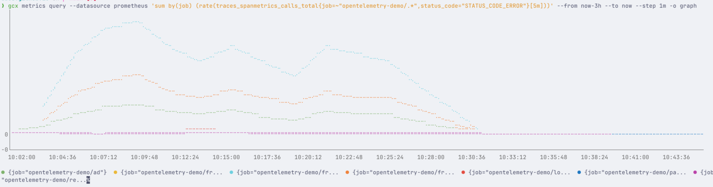
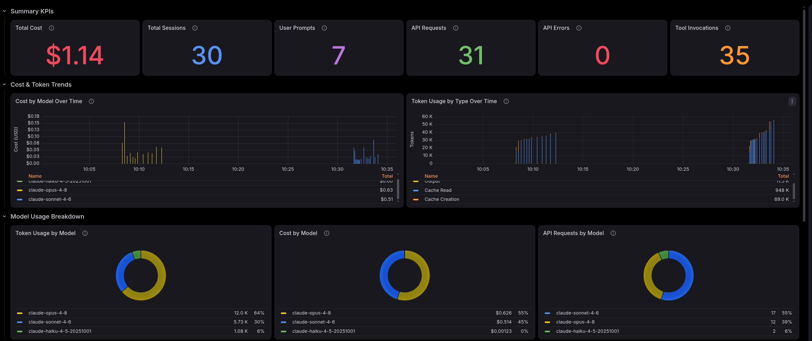

Hackathon day 3, a new day with enough options to explore.

## OpenTelemetry demo setup with 'problems'
Like I did [last year](../monitoring-buddy-hackathon-day-2) I started the OpenTelemetry demo setup.    
That setup is a 'webshop' with all kinds of services, all instrumented with OpenTelemetry, and a feature flag service to trigger problems in the setup.
I started the setup, I pushed the OpenTelemetry data to my own local Grafana stack.

In the feature flag service I switched the toggle for the 'ad-service' to introduce some problems.

Now I want to test both Opus 4.8 and Sonnet 4.6 with `gcx` and the `debug-with-grafana` skill.

```shell
there are issues with our webshop. can you find out which service is failing with /debug-with-grafana
```

### Opus 4.8

The first try is with Opus 4.8, it came with this conclusion:

```shell
I have a clear diagnosis. Here's the summary.

Diagnosis: the ad service is the failing component

Webshop: OpenTelemetry Demo (astronomy shop) · Window: last 1h (as of ~10:48)

What's failing

┌──────────────────────────────────────────┬────────────┬───────────────────────────┐
│                 Service                  │ Error rate │     Failing operation     │
├──────────────────────────────────────────┼────────────┼───────────────────────────┤
│ ad                                       │ 4.9%       │ oteldemo.AdService/GetAds │
├──────────────────────────────────────────┼────────────┼───────────────────────────┤
│ frontend                                 │ 0.5%       │ (propagated from ad)      │
├──────────────────────────────────────────┼────────────┼───────────────────────────┤
│ frontend-proxy                           │ 0.2%       │ (propagated)              │
├──────────────────────────────────────────┼────────────┼───────────────────────────┤
│ recommendation, payment, fraud-detection │ 0.0%       │ healthy                   │
└──────────────────────────────────────────┴────────────┴───────────────────────────┘

Evidence chain

- Metrics — ad has by far the highest error ratio (4.9% vs ≤0.5% everywhere else). Its raw error rate (0.04/s) feeds the frontend's higher raw count, so the frontend errors are symptoms, not the cause.
- Logs — the ad service is logging, repeatedly and exclusively:
  GetAds Failed with status Status{code=UNAVAILABLE, description=null, cause=null}
- Traces — all error traces touching ad are rooted at frontend-web GET requests, confirming user-facing webshop requests are the ones impacted when they hit the ad path.

Likely root cause

The ad service is throwing gRPC UNAVAILABLE on GetAds. In the OpenTelemetry Demo this is the signature of the adServiceFailure (or adService fault-injection) feature flag being enabled in flagd, which makes a fraction of GetAds calls fail deliberately. The ~4.9%
partial failure rate (not 100%) is consistent with flag-driven fault injection rather than the service being down — up shows the service is scraped and alive, and other spans (e.g. flagd.evaluation EventStream) succeed.

Recommended next actions

1. Check flagd — open the flagd-ui (flagd-ui service) or its config and look for an enabled adServiceFailure/adManualGc/adHighCpu flag. Set it back to the off variant to clear the fault.
2. If no flag is set, inspect the ad service's own downstream gRPC dependency (the UNAVAILABLE status points to a dependency it can't reach) and restart/redeploy it.
3. Re-check sum by(service_name)(rate(traces_span_metrics_calls_total{status_code="STATUS_CODE_ERROR"}[5m])) after the change — frontend errors should drop in lockstep with ad, confirming the fix.

Want me to inspect the flagd configuration to confirm which flag is enabled?
```

### Sonnet 4.6

In a new session I asked Claude again, but now with the Sonnet model.

```shell 
...
● Bash(gcx metrics query --datasource prometheus 'sum by(job) (rate(traces_spanmetrics_calls_total{job=~"opentelemetry-demo/.*",status_code="STATUS_CODE_ERROR"}[5m]))' --from now-1h --to now --step 5m -o graph 2>/dev/null)
⎿    │              ⢀⣀
│          ⢀⡠⠔⠊⠁ ⠉⠉⠉⠒⠒⠒⠤⠤⠤⣀⣀⣀
│       ⣀⠤⠒⠁                 ⠉⠉⠒⠤⢄⣀
│   ⢀⡠⠒⠉                           ⠉⠒⠢⠤⣀             ⣀⣀⡠⠤⠤⠒⠢⢄⡀
│⡠⠔⠊⠁          ⣀⣀⣀                      ⠉⠑⠒⠤⣀⣀⠤⠤⠔⠒⠒⠉⠉        ⠈⠑⠢⣀
│      ⢀⣀⡠⠤⠒⠒⠉⠉   ⠉⠉⠉⠉⠉⠒⠒⠒⠒⠒⠤⠤⠤⢄⣀⣀⡀                              ⠉⠒⠤⣀
│⣀⠤⠤⠒⠒⠉⠁                          ⠈⠉⠉⠑⠒⠒⠢⠤⠤⢄⣀⣀⣀⠤⠤⠤⠤⠤⠒⠒⠒⠒⠒⠉⠉⠉⠒⠒⠤⠤⣀⡀   ⠑⠢⢄⡀
│⣀⣀⡠⠤⠤⠤⠤⠔⠒⠒⠒⠒⠊⠉⠉⠉⠉⠉⠉⠉⠉⠉⠉⠉⠉⠉⠉⠉⠉⠉⠉⠒⠒⠒⠢⠤⠤⠤⢄⣀⣀⣀    ⣀⣀⣀⣀⣀⠤⠤⠤⠤⠤⠒⠒⠒⠢⠤⠤⢄⣀⣈⡉⠑⠒⠤⠤⣀⣈⠑
0│⣀⣀⣀⣀⣀⣀⣀⡀      ⢀⣀⣀⣀⣀⣀⣀⣀⣀⣀⣀⣀⣀⣀⣀⣀⣀⣀⣀⣀⣀⣀⣀⣀⣀⣀⣀⣀⣉⣉⣉⣉⣀⣀⣀⣀⣀⣀⣀⣀⣀⣀⣀⣀⣀⣀⣀⣀⣀⣀⣀⣈⣉⣉⣑⣒⣒⣢⣭
│       ⠈⠉⠉⠉⠉⠉⠉⠉⠉⠉⠉⠉⠉⠉⠉              ⠈⠉⠉⠉⠉⠉⠉⠉⠉⠉⠉⠉⠉⠉⠉⠉⠉⠉⠉⠉⠉⠉⠉⠉⠉⠉⠉⠉⠉⠉⠉⠉⠉⠉⠉⠉⠉
-0└─────────────────────────────────────────────────────────────────────────
10:05:00    10:09:06    10:13:13    10:17:19    10:21:26    10:25:32

     ● {job="opentelemetry-demo/ad"}  ● {job="opentelemetry-demo/fr...  ● {job="opentelemetry-demo/fr...  ● {job="opentelemetry-demo/fr...  ● {job="opentelemetry-demo/lo...  ● {job="opentelemetry-demo/pa...  ● {job="opentelemetry-demo/re...

                                                                                                                                                                                                                                                                                                                                                                                                       10:34 AM claude-sonnet-4-6
● I now have a complete and clear diagnosis. Here is the summary:

  ---
Diagnostic Summary

Service: opentelemetry-demo/ad (root cause)
Affected: opentelemetry-demo/frontend, opentelemetry-demo/frontend-proxy
Time window: Last ~30 minutes (~10:05–10:25 today)

  ---
Error signal

The error graph shows a clear spike starting ~10:07, peaking around 10:11, then gradually tapering:

┌──────────────────────────────────────────┬───────────────────┬─────────────────────────────┐
│                 Service                  │  Peak error rate  │           Status            │
├──────────────────────────────────────────┼───────────────────┼─────────────────────────────┤
│ frontend                                 │ ~0.22 errors/sec  │ Primary user-facing impact  │
├──────────────────────────────────────────┼───────────────────┼─────────────────────────────┤
│ frontend-proxy                           │ ~0.12 errors/sec  │ Propagating frontend errors │
├──────────────────────────────────────────┼───────────────────┼─────────────────────────────┤
│ ad                                       │ ~0.05 errors/sec  │ Root cause                  │
├──────────────────────────────────────────┼───────────────────┼─────────────────────────────┤
│ payment, recommendation, fraud-detection │ ~0.003 errors/sec │ Low-level, likely unrelated │
└──────────────────────────────────────────┴───────────────────┴─────────────────────────────┘

  ---
Root cause: Ad Service returning gRPC UNAVAILABLE (code 14)

The trace is conclusive:

load-generator
→ GET /api/data → HTTP 500
→ frontend (Next.js)
→ gRPC oteldemo.AdService/GetAds → STATUS_CODE_ERROR
→ ad service
exception: "14 UNAVAILABLE: "

The ad service is returning gRPC status 14 (UNAVAILABLE) on every GetAds call. This propagates up through the frontend API route (/api/data) as HTTP 500, which users see as broken webshop pages.

  ---
Underlying cause: flagd feature flag service connection failing

A second trace reveals the likely trigger: the ad service maintains a long-running gRPC streaming connection to flagd:8013 (flagd.evaluation.v2.Service/EventStream) for feature flag evaluation. That stream ran for 600 seconds (10 minutes) and terminated with gRPC status 4 (DEADLINE_EXCEEDED).

The ad service appears to use flagd to control ad behavior, and when the flagd EventStream connection degrades, the ad service enters an UNAVAILABLE state for incoming requests.

  ---
Recommended next actions

1. Check flagd service health — flagd:8013 is the immediate suspect. Restart or investigate why the EventStream is timing out after 10 minutes.
2. Restart the ad service — once flagd is healthy, the ad service needs to re-establish the EventStream connection to recover.
3. Add a health/readiness check to the ad service that reflects flagd connectivity, so traffic is shed automatically when flagd is unreachable rather than returning UNAVAILABLE to callers.

```

#### Nice terminal graphs

In the documentation of gcx I already saw that you can create graphs in the terminal, but I had not used that yet.
Now I see that Sonnet used that option. While I think text would be more useful for the LLM, it is still a nice feature.
But with a command like this `gcx metrics query --datasource prometheus 'sum by(job) (rate(traces_spanmetrics_calls_total{job=~"opentelemetry-demo/.*",status_code="STATUS_CODE_ERROR"}[5m]))' --from now-1h --to now --step 5m -o graph` you can create nice graphs in the terminal



### Model token and cost compare

Both models came, more or less, to the same conclusion.    
Let's have a look at the usage statistics from `/usage`

Usage of the first run with Opus 4.8
```shell
Total cost:            $0.63                                                                                                                                                                                                                                          
Total duration (API):  1m 30s
Total duration (wall): 15m 37s
Total code changes:    0 lines added, 0 lines removed
Usage by model:
  claude-haiku-4-5:  523 input, 18 output, 0 cache read, 0 cache write ($0.0006)
  claude-opus-4-8:  6.2k input, 5.8k output, 355.4k cache read, 27.3k cache write ($0.63)
```

Usage of the second run with Sonnet 4.6
```shell 
Total cost:            $0.53
Total duration (API):  2m 8s
Total duration (wall): 12m 12s
Total code changes:    0 lines added, 0 lines removed
Usage by model:             
  claude-haiku-4-5:  523 input, 18 output, 0 cache read, 0 cache write ($0.0006)
  claude-sonnet-4-6:  93 input, 5.8k output, 648.2k cache read, 42.3k cache write ($0.53)
```

These differences are visible as well in the OpenTelemetry data from Claude


Based on the 2 runs, you can say Sonnet is cheaper and uses fewer tokens, but it made slightly more API calls.
The current issue was pretty straightforward; in these cases, with the right guidance from the skill file(s) and the right tooling like the gcx tool, Sonnet is a good choice.
As soon as the issue becomes more complex, you probably need Opus with more reasoning and thinking power.
This is just based on 2 runs; more runs on different scenarios should be done to get a more precise picture.

For now, I'll stop here, as I also want to explore other features of the gcx tool.

### Wrap up

The remainder of the day I have been less productive with testing, but more with exploring all kind of opportunities based on documentation of Claude and other websites about agents and skills.         
One of the things I am currently busy with on a project is configuring OpenTelemetry Collectors for data retrieval and filtering/adjusting that data with processors.
I am thinking of creating a skill file for this, as it is a common task.    
The skill files I found so far do not cover the parts I need.    

#### My conclusion after 3 hackathon days with Observability and AI

Again I learned a lot about many topics, all around AI and how to apply it to observability topics.
And when I look back on the results of the previous hackathon, the progress in AI and AI guidance has been immense.
Context is key, and it was pretty hard to feed AI with the right context and guidance. Sub-agents and skills are key to making AI much more effective.
Grafana gcx is a powerful tool that the LLM can use to retrieve data from Grafana, and with the skill files, the right guidance can be provided to make it really effective.
As gcx is authenticated with a service account in Grafana, you are truly in control of which data is shared with the LLM.

I did not test it, but I expect that if you write down in a skill or CLAUDE.md file which metrics are important to check, the LLM will be very fast and effective in finding the right data.
That is what you normally do as well, in a dashboard you show the important metrics, as these are key to your application.
In the same way, we should help an LLM to find the right data by providing the right context and guidance.    
If that is not sufficient, the LLM can look further and find the data itself, but that will take much more time and tokens. 
