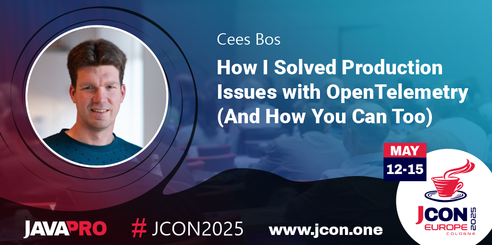

#### Slides



#### Details about code examples

An overview of the demo setup I used during the presentation:   
   

The `K6` scripts and the code of `Alpha` en `Beta` services can be found here:   
🖵 [https://github.com/cbos/solving-problems-with-opentelemetry](https://goto.ceesbos.nl/solving-problems-with-otel)

The `OpenTelemetry collector`, `Prometheus`, `Tempo`, `Loki` and `Grafana` are part of the Observability Toolkit:   
🖵 [https://github.com/cbos/observability-toolkit](https://goto.ceesbos.nl/observability-toolkit)

##### OpenTelemetry documentation

As mentioned during the talk, OpenTelemetry has a lot of good documentation.   
Here are some links:   
- 🗎 [Java support introduction](https://opentelemetry.io/docs/languages/java/intro/)

And some more links on zero code/auto-instrumentation:   
- 🗎 [Java agent](https://opentelemetry.io/docs/zero-code/java/agent/)   
- 🗎 [Annotations](https://opentelemetry.io/docs/zero-code/java/agent/annotations/) to create internal spans for example   
- 🗎 [API](https://opentelemetry.io/docs/zero-code/java/agent/api/) to enrich your spans and create custom metrics    

#### 📣 Application Observability Code Challenges

With [Application Observability Code Challenges](/posts/application-observability-code-challenges) you can practice yourself.    
The goals of the challenges:

The goals of the challenges:
- 🎉 - Have fun !
- 🖵 - Learn to understand the behaviour of the code
- 📈 - Learn how to use observability tools to understand code behaviour 📈
- 🔍 - Spot the unexpected behaviour!
- 🤗 - Practice and learn!
- 🎁 - Share your findings and solution, either as a comment or as a pull request

Here is a list of available code challenges:



#### JCON Talk announcement

